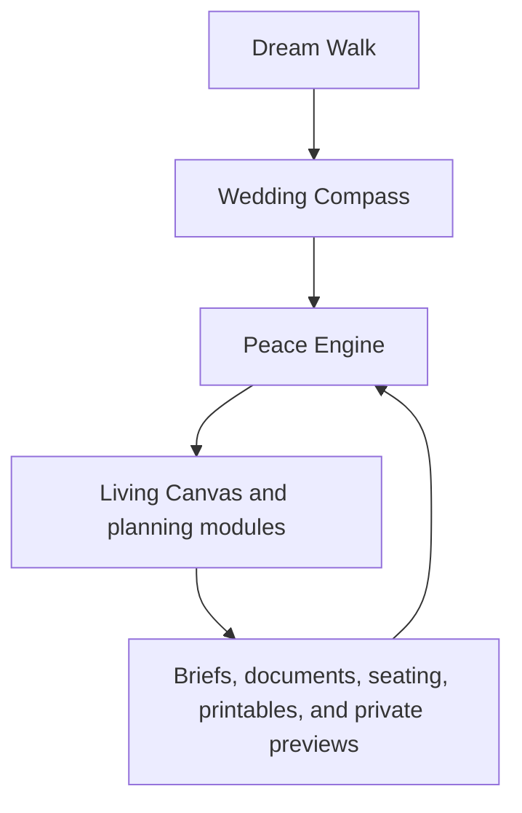

# The Missing Peace

## One Engine Redesign and Implementation Plan

**Product:** The Missing Peace Wedding Planning Engine  
**Scope:** Full product redesign from Dream through planning, collaboration, and outputs  
**Reference implementation:** The Missing Peace source snapshot, current shared wedding state, and Feast Studio redesign plan  
**Design standard:** A romantic creative playground that quietly produces a practical, trustworthy wedding plan  
**North star:** **Build the world your love will walk into.**

## 1. Executive decision

The Missing Peace should become one connected wedding planning engine, not a collection of romantic pages with a common header. Dream is the opening feature. It gathers what the couple wants the day to feel like, converts those wishes into a Wedding Compass, and gives the Peace Engine a durable set of priorities to carry through every decision.

The Living Canvas remains the hero interface, but it is not the underlying product. It is the creative surface where the couple can see, shape, and feel the wedding world. The engine underneath it connects the Compass to guests, budget, vendors, timeline, seating, documents, private notes, the guest experience preview, and generated printables. Every module should read from the same project model, write back to that model, and explain what changes elsewhere when a meaningful choice is made.

The product should feel intimate before it feels technical, visual before it feels administrative, and trustworthy before it feels magical. Poetry should invite the decision. The interface should then make the consequence clear.

The current prototype already contains the raw ingredients: Dream Clouds, Wedding Compass, Peace Center, Design Studio, Feast Studio, Atmosphere Lab, The Atelier, Decisions, Money Map, Vendors, Guests, Seating Studio, Website, Printables, Documents, Playlist, Honeymoon, and Peace Notes. The redesign does not need more top level features. It needs one model, one navigation system, one intelligence layer, and one set of interaction rules.

## 2. The product model

The product has four layers. They should be visible in the experience, but they should not become four separate applications.

| Layer | Meaning | Primary surface |
| --- | --- | --- |
| Dream | What the couple wants to feel, protect, remember, and avoid | Dream Walk and Dream |
| Compass | The durable interpretation of those wishes | Wedding Compass |
| Engine | The intelligence, dependencies, readiness, and next actions derived from the Compass and project data | Peace Center and contextual Peace Panel |
| World | The creative plan and practical outputs created from the shared model | Living Canvas, planning modules, and outputs |

The central relationship is:



The feedback loop matters. A palette change should update the visible world. A guest requirement should update meal coverage, seating context, the caterer brief, and a Peace Engine action. A decision about the meal should update the budget, timeline, vendor questions, and related printables. The product should never ask users to manually repeat the same decision in multiple pages.

## 3. What the current build gets right

The emotional vocabulary is strong. The phrases “Your Dream Clouds,” “Your Compass has found its words,” “Build the world your love will walk into,” “what should the day taste like,” and “the private emotional layer” establish a distinct point of view. That voice should remain.

The current state model is also a meaningful foundation. `wedding-state.js` already attempts to provide one source of truth through a shared `WeddingState`, browser persistence, subscribers, a storage event, derived budget totals, and a Peace Score. The seeded data demonstrates the intended richness: dreams, a wedding profile, guests, food scenes, restrictions, attire looks, vendors, budget categories, documents, notes, and notifications.

The Feast Studio plan adds the right operational discipline. Its three zone model, Feast Map, Tasting Canvas, and Peace Panel should become the pattern for the entire product. Progressive disclosure, explicit loading and recovery states, real routes, derived projections, mobile first collaboration, WCAG 2.2 AA, and advisory financial guidance are not Feast specific rules. They are product rules.

The homepage and Dream Walk are closest to the intended magic. They should become the emotional standard for every surface after the user enters the application.

## 4. What is currently preventing the product from feeling like one engine

The current source snapshot contains repeated navigation and repeated page shells across many standalone HTML documents. That structure makes every screen look like it belongs to the same family, but it does not make the screens behave like one product. A shared `localStorage` object is not enough. The product needs a shared domain layer, route state, derived selectors, mutation events, dependency records, and consistent action language.

The `Board.html` experience is doing too much at once. It contains the Design Studio, the Feast Studio, the Atmosphere Lab, and The Atelier in one very large implementation. That is why it feels like a polished dashboard even when the copy is emotional. The user is being asked to manage identity chips, emotion chips, guest coverage, courses, restrictions, presentation notes, palette swatches, and attire fields in a single long surface. The new Board should remain the doorway to the three studios, but each room needs its own spatial grammar and focus.

The current `WeddingState.peaceScore()` measures Compass approval, timeline status, settled decisions, budget status, booked vendors, and signed documents. It does not measure whether the couple understands their most important choices, whether guests are cared for, whether the plan is feasible, or whether the creative world is coherent. A single score that ignores the signature experience will feel decorative rather than intelligent.

The current mobile script primarily adds drawer swipe behavior. It does not create a mobile interaction model. The redesign must treat mobile as a first class composition with a dedicated shell, bottom navigation, full screen modes, bottom sheets, sticky actions, safe area support, and vertical alternatives to every horizontal or desktop only interaction.

The current Website surface includes public guest website language and publishing controls. Version one must not publish a public guest page. It should become a private Guest Experience preview that is generated from the same plan and can be exported later when that capability is intentionally released.

The current prototype also contains visible unresolved template expressions in some rendered states. The new implementation must include a build check that fails when unresolved interpolation tokens such as `{{ ... }}` reach the user interface.

## 5. The Wedding Compass is the product contract

Dream should not simply produce a sentence and a collection of floating clouds. It should produce a structured Wedding Compass that every module can use without asking the couple to repeat themselves.

The Compass should preserve both the poetic meaning and the practical interpretation. For example, “one long, generous table” should remain a human phrase, but the engine should also understand that it may imply family style service, a long table or grouped long tables, communal presentation, higher service coordination, a shared meal narrative, and seating decisions that prioritize household and family proximity.

The Compass should contain the following domains:

| Compass domain | Examples | Downstream influence |
| --- | --- | --- |
| Feeling | Warm, intimate, playful, peaceful, dramatic | Atmosphere, music, language, lighting, website preview |
| People | Family centered, community centered, private, intergenerational | Guest experience, seating, meal, timeline |
| Hospitality | Everyone included, thoughtful alternatives, abundant, relaxed | Feast coverage, service style, signage, vendor brief |
| Meaning | Faith, culture, memory, place, ancestry, ritual | Notes, ceremony, food stories, attire, playlist |
| Boundaries | No owner dependency, no performance, no alcohol, no late night pressure | Decisions, vendor questions, risk flags, timeline |
| Practical shape | Guest estimate, date confidence, location, budget guidance, planning stage | Timeline, Money Map, vendor readiness, document deadlines |

Each Compass item needs an identifier, a human phrase, a normalized code, its source, its strength, and the modules it influences. It should also have an explanation written in plain language. Users should be able to ask, “Why is this influencing my meal plan?” and get a useful answer.

The Compass is not locked forever. Approval means the couple agrees that it represents the current direction. It can be revisited, versioned, and changed. When a major Compass item changes, the Peace Engine should show a ripple preview before applying recommendations.

## 6. Dream and Dream Walk redesign

Dream Walk should be the ceremonial entrance into the product. It should not feel like a generic onboarding questionnaire. It should feel like the first room in the world the couple is creating.

The flow should ask only questions that can change a meaningful recommendation. The current season, light, intimacy, and feeling questions are good foundations, but each answer needs visible consequence. After each choice, the user should see a small Dream Cloud appear and a sentence explaining what that choice may shape.

The recommended sequence is:

1. Choose the shape of the gathering, from intimate to expansive.
2. Choose the light or time of day that feels like the day.
3. Choose the emotional center, such as family, adventure, faith, calm, celebration, or cultural continuity.
4. Choose the kind of hospitality the couple wants guests to remember.
5. Add freeform dreams, boundaries, people, traditions, and non negotiables.
6. Review the generated Compass and approve it together.

The system should allow the couple to skip a question, return to it later, or keep an answer as a dream without turning it into a task. The product should not punish uncertainty. A dream can remain open.

At the end of Dream Walk, the couple sees a Compass composition with a sentence, a few highlighted Dream Clouds, a first recommended next action, and a preview of the modules that will be shaped. For example: “Because you chose a family centered, warm, communal celebration, we prepared a shared table meal shape, a long table seating starting point, a candlelit atmosphere direction, and a planning watch list for guest care.”

The Dream page should then become the place to manage the Compass. Users can drag a cloud toward the center to raise its priority, mark a cloud as Real, return it to Dreaming, add a reflection, or connect it to a planning decision. The act of making something real should create a visible record in the project, not just change a decorative status.

Every realized Dream Cloud should show its ripples. A card might say: “Family and our people is influencing Feast, Seating, Timeline, Playlist, and Peace Notes.” Selecting the card opens the affected modules, not a dead end.

## 7. The Peace Engine

The Peace Engine is the intelligence layer. It should answer three questions continuously:

1. What is the couple trying to protect?
2. What is currently at risk or unresolved?
3. What is the most helpful next action?

The engine should combine deterministic rules with optional generated guidance. Deterministic rules handle dependencies, missing data, coverage conflicts, budget arithmetic, timeline ordering, vendor status, and document deadlines. Generated assistance can summarize a plan, propose drafts, explain a pattern, or suggest language, but it must never silently create a confirmed fact or override user authored decisions.

The Peace Engine should produce four primary projections:

| Projection | Purpose |
| --- | --- |
| Next action | One recommended step that can be completed or intentionally deferred |
| Watch list | Risks and unknowns that need attention, with evidence and an owner |
| Ripple map | The modules affected by a meaningful change |
| Readiness | A view of whether the current plan is understandable, cared for, feasible, and ready to hand off |

Replace the current broad Peace Score with a Peace Readiness model. Keep the top status pill because it is part of the product language, but make the underlying model more honest.

| Readiness dimension | What it measures |
| --- | --- |
| Clarity | Compass approved, major decisions understood, key facts known |
| Care | Guest requirements represented, meal coverage assessed, conflicts resolved or acknowledged |
| Feasibility | Venue, service, staffing, budget guidance, timing, and vendor questions are coherent |
| Alignment | Partners and collaborators have approved or commented on meaningful choices |
| Handoff | Briefs, documents, timeline, seating, and generated outputs are complete enough to use |

Each dimension should show a score, a plain language explanation, and the open items that influence it. The score should never imply that an allergy or religious requirement is “safe” because a checkbox was selected. Confidence states need to be explicit.

The engine should create human readable decision records whenever a meaningful action changes the project. Examples include: “Changed the Main Course from plated to family style,” “Added a separate certified kosher meal as an open vendor requirement,” “Protected catering in the Money Map,” or “Accepted the last dance as the closing moment.”

## 8. Peace Center redesign

Peace Center should be the command center, not another dashboard of metrics. Its first screen should open with a calm summary of what matters now and a single next action.

The opening composition should contain a compact Compass statement, the current Peace Readiness status, the most important watch item, the next action, and a visual strip of recent ripples. Below that, the user can enter a focused module.

The engine should avoid presenting ten equal priority cards. The hierarchy should be:

1. The one thing worth doing next.
2. The one risk that deserves attention.
3. The current readiness story.
4. Recent decisions and their ripples.
5. A quieter overview of planning areas.

Every recommendation needs a reason. “Review catering agreement” is less useful than “Your menu direction is family style, but the current catering agreement still describes plated service. Review the service language before signing.”

Peace Center should support a focus mode. Selecting an action should open the relevant module in context, with the Peace Panel still available. The user should never lose the reason they entered a screen.

## 9. The Living Canvas and Design Studio

The Board should be renamed in the product language as the Living Canvas while the existing Design Studio label can remain as a supporting phrase. The Living Canvas is the visual surface where the couple shapes the world. It is not a place to store a second copy of the data.

The global structure should be:

| Zone | Purpose | Desktop | Mobile |
| --- | --- | --- | --- |
| Dream Drawer | Shows the Compass, inspirations, active dreams, and linked ripples | Persistent left rail | Full screen drawer or bottom sheet |
| Living Canvas | Active creative workspace for Feast, Atmosphere, or Atelier | Primary center surface | Full width room view |
| Peace Panel | Shows coverage, readiness, cost guidance, risk, and next action | Persistent right rail | Insights destination and contextual sheet |

The three rooms remain:

| Room | Promise | Signature interaction |
| --- | --- | --- |
| The Feast Studio | Build the meal every guest can enter, understand, and enjoy | Walk through the meal as a living table and guest care story |
| The Atmosphere Lab | Design the feeling before anyone says a word | Change one atmosphere decision and watch it ripple through the day |
| The Atelier | Design the story your love will wear | Compose looks in the context of the actual day |

The room selector should not be a crowded row of pills on mobile. It should be three room cards with a title, poetic promise, progress, and a clear action. Desktop can use a compact contextual switcher after the user enters the Living Canvas.

### 9.1 The Dream Drawer

The Dream Drawer contains Dream Clouds, saved inspirations, realized ideas, and the current Compass summary. An inspiration can be saved with a source, an optional note, a category, and a relationship to one or more rooms. “Poof this” should create a draft object with provenance. It should never overwrite an approved plan.

The Drawer should include a filter for All, Food, Atmosphere, Attire, Guest Experience, Ceremony, and Afterglow. Selecting an item should open the room or module where it can become real.

### 9.2 The Living Canvas

The center should feel like a creative workspace, not a long form. One primary object should occupy the visual center. In Feast, that object is the meal journey. In Atmosphere, it is the living day preview. In Atelier, it is the look composition and context preview.

The center should use staged interaction. First show the scene or object. Then reveal the decision controls. Then show the consequence. Avoid showing every field at once.

### 9.3 The Peace Panel

The Peace Panel should be useful before any generated image or preview is ready. It should show deterministic coverage, readiness, cost guidance, execution concerns, and the next action. Generated previews are secondary. If preview services fail, the plan remains usable.

## 10. The Feast Studio redesign

The Feast Studio is the signature wedge of the Living Canvas. It should feel like a tasting table, hospitality engine, and food journey. It must not feel like a menu administration screen.

The north star for the room is:

**Build a meal every guest can enter, understand, and enjoy.**

The room should open with the Feast Canvas rather than a list of dishes. The Feast Canvas represents the meal from arrival to sendoff:

Welcome drink, passed bites, grazing table, first course, main course, dessert, late night bite, tea or coffee, and sendoff treat.

Each scene is a moment in the day. It should have a purpose, mood, timing, service style, dish count, guest care signal, and readiness state. The user can reorder scenes, add a custom moment, intentionally leave a scene empty, or choose a template such as plated dinner, family style celebration, cultural feast, stations and grazing, brunch, cocktail reception, or intimate dinner.

On desktop, use the Feast Map on the left, the Tasting Canvas in the center, and the Peace Panel on the right. On mobile, use a vertical Feast Journey. A horizontal shortcut may show the previous, current, and next scene, but the complete meal must always be available as a vertical list.

Each dish card should show the dish name, why it belongs, who it cares for, compatibility and confidence, vendor verification needs, presentation direction, guest experience impact, and an advisory budget or complexity signal. The collapsed card should be quiet and scannable. The expanded card should reveal story, requirements, evidence, preparation notes, comments, and history.

Adding a dish should use four progressive steps: Basics, Guest Fit, Production, and Meaning. The first save needs only the scene, dish name, and role in the meal. Requirement assessment should not pretend to be complete before ingredients and preparation details exist. Suggestions create Draft dishes with a rationale and never overwrite confirmed data.

### 10.1 Guest Care Preview

The Guest Care Preview should be framed as hospitality intelligence. It should not merely display “partial,” “full,” or “none.” It should explain what the current plan provides, what is missing, why it matters, and what action will resolve it.

Examples of the intended language include:

“Your halal and alcohol free guests currently have a suitable welcome drink and soup, but the main course still needs a verified meat source or a fully satisfying alternative.”

“Your vegan and gluten free guests have a complete savory meal, but dessert still needs a separate plated option.”

“Kosher certified guests are not covered by the current menu unless certified meals are sourced separately.”

“Guests with a severe nut allergy need separate preparation, dedicated utensils, and clear labeling.”

The preview should show Covered, Needs review, and Conflict counts. Selecting a guest group should reveal the affected dishes and the next action. On mobile, Guest Care becomes a swipeable card stack or bottom sheet with one group visible at a time.

### 10.2 Hospitality Score

The Feast Studio should contain a Hospitality Score or Guest Care Meter. It should never be presented as a moral grade. It is a planning readiness signal built from:

| Signal | Meaning |
| --- | --- |
| Meal coverage | How many guest requirements have a plausible meal path |
| Confidence | How many assessments are known, ingredient compatible, vendor confirmed, or documented |
| Verification readiness | Whether required evidence and preparation questions exist |
| Presentation completeness | Whether the plan explains how the care will be visible and dignified |
| Menu story strength | Whether the meal expresses the approved Compass without creating execution confusion |

The score should sit beside a plain language summary such as “The meal is generous and emotionally coherent. Two care requirements still need vendor confirmation.”

### 10.3 Requirement language

Replace ambiguous flat chips with requirement, assessment, evidence, and preparation layers.

| Requirement | Correct interpretation |
| --- | --- |
| Halal compatible ingredients | Ingredients may be compatible, but meat source and preparation still need confirmation |
| Zabiha | Verified slaughter source is required |
| Kosher style | Not kosher certified and cannot satisfy a certified requirement |
| Kosher certified | Sourcing, preparation, supervision, or qualifying evidence is required |
| Gluten free | Ingredient claim only until preparation and cross contact controls are confirmed |
| Celiac requirement | Cross contamination controls, separate preparation, and clear service handling are required |
| Allergy requirement | Separate preparation, labeling, and vendor confirmation are required |

Use the assessment states Unknown, Ingredient compatible, Vendor confirmed, Certification documented, and Conflict. Never use “safe” as a universal status.

### 10.4 Caterer brief

The Caterer Brief is a live projection from the Feast Plan. It should include event facts, meal intention, service sequence, dishes, guest counts, requirements, preparation protocols, presentation notes, staffing assumptions, equipment, open questions, evidence, and decision history.

Version one remains advisory and private. It supports preview, internal comments, versioning, and PDF export. It does not include payment processing, a vendor portal, or a public sharing page. Vendors remain internal records. When the plan changes, the brief should show which sections are affected before generating a new version.

## 11. The Atmosphere Lab redesign

The Atmosphere Lab should be an atmosphere control room, not a palette picker. Its core promise is:

**Design the feeling before anyone says a word.**

The opening view should show the current atmosphere as a live day preview with a compact palette summary, emotional words, light direction, and an explanation of the current visual logic. Changing a color, light, material, or atmosphere word should immediately update a set of preview surfaces.

The preview surfaces should include invitation, wedding website preview, tablescape, attire, florals, cake, menu card, ceremony setting, reception lighting, and the private Peace Notes cover. The user should see a visible change when a decision changes. A color selection that only changes a swatch is not enough.

The Lab should produce practical guidance such as:

“Sage carries the calm and natural quality of your Compass. Clay adds warmth to the reception without competing with the candlelight. Keep the ink tone charcoal so the menu and invitation remain legible.”

The system should distinguish between palette tokens, surface applications, and exceptions. A user can apply a palette to the whole world, then override a surface intentionally. The engine should record the override and show where the world is no longer aligned.

On mobile, use a horizontal preview carousel with one surface visible at a time. Place the palette controls below the preview, not above a long row of chips. Use large touch targets and show the current surface name clearly.

## 12. The Atelier redesign

The Atelier should feel like a fashion studio, not a set of basic look cards. Its promise is:

**Design the story your love will wear.**

The current look composer can remain as a foundation, but it should become a guided composer with context. The user should choose who is being styled, then shape silhouette, fabric, color, accessories, formality, modesty, movement, and weather or venue needs.

Every look should be previewable in the context of the actual day: aisle, portraits, reception lighting, dance floor, beside partner, beside the wedding party, and against the approved palette. If photorealistic or 3D previews are not available, use illustrated context cards with clear Beta labeling. Do not present a mannequin placeholder as finished intelligence.

Couple Harmony should explain the relationship between the two primary looks. It should identify whether they feel beautifully balanced, too formal, too casual, visually disconnected, or aligned with the Compass. Wedding Party Harmony should show color, formality, silhouette, and movement relationships without requiring identical outfits.

Approval should remain collaborative and editable. The current hard coded approver labels such as Maya, Julian, and Aria must become project roles with editable names and labels. The product should use the couple’s chosen labels rather than assuming bride and groom.

On mobile, use a guided Look Composer with one decision group visible at a time and swipeable context previews. Avoid attempting a dense 3D editor inside a normal scrolling page.

## 13. Planning modules as connected projections

The remaining modules should feel like different views of the same wedding world. They should not be forced into the same visual composition as the three studios, but they must use the same shell, domain model, actions, statuses, and ripple language.

| Existing surface | Redesigned role | Reads from | Writes back |
| --- | --- | --- | --- |
| Homepage | Emotional front door and identity selection | Project invitation or new project state | Selected participant role |
| Dream Walk | Guided origin story and Compass creation | Dream answers and project profile | Compass, Dream Clouds, first watch list |
| Dream | Compass editor and Dream Cloud map | Compass and clouds | Priorities, realized dreams, linked intentions |
| Peace Center | Command center | All derived projections | Action completion, decision focus, dismissal or acceptance |
| Board | Living Canvas doorway | Compass, inspirations, progress | Room selection and creative drafts |
| Feast Studio | Meal journey and hospitality intelligence | Guests, requirements, Compass, vendors, budget | Scenes, dishes, assessments, evidence, brief versions |
| Atmosphere Lab | Live visual world | Compass, palette, materials, rooms | Palette tokens, surface applications, exceptions |
| The Atelier | Contextual attire studio | Compass, palette, venue, season, party | Looks, approvals, attire requirements, harmony notes |
| Decisions | Decision ledger and rationale | Engine recommendations and linked objects | Options, votes, rationale, final decisions |
| Money Map | Advisory financial model | Vendors, decisions, guest estimate, modules | Guidance, protected categories, assumptions, scenarios |
| Timeline | Planning roadmap and Run of Day | Date, venue, vendors, decisions, meal, music | Milestones, tasks, dependencies, day sequence |
| Vendors | Internal vendor records | Compass, module needs, documents, budget | Vendor status, contact notes, open questions, evidence |
| Guests | Guest CRM and care model | RSVPs, households, requirements, meals | Guest facts, attendance, meal requirements, travel notes |
| Seating Studio | Seating graph and arrangement mode | Guests, households, VIPs, requirements, venue tables | Table plan, assignments, conflicts, exceptions |
| Website | Private Guest Experience preview | Compass, website content, timeline, menu, attire | Preview content and future publication readiness |
| Printables | Generated paper outputs | Guests, seating, menu, timeline, Compass | Export versions and stale state |
| Documents | Private document vault | Vendors, briefs, agreements, generated exports | Status, signers, deadlines, notes, versions |
| Playlist | Soundtrack by moment | Compass, timeline, guest requests | Tracks, requests, hard no list, moment associations |
| Honeymoon | Afterglow planning space | Preferences, budget guidance, notes | Destination, wishes, itinerary drafts |
| Peace Notes | Private emotional layer | Dream, people, memories, rituals | Letters, vows, poems, sealed notes, optional links |

### 13.1 Decisions

Decisions should become the connective tissue between intention and execution. Every major decision should show its linked Dream Cloud, the options considered, who has participated, the current state, the reason, and the modules it affects.

The user should be able to open a decision from Peace Center, Feast, Money Map, Timeline, or Vendors and return to the same decision record. Settling a decision should create a ripple summary. Reopening it should show which downstream objects may become stale.

### 13.2 Money Map

Money Map should remain advisory. It should show funds, planned commitments, paid amounts, scheduled amounts, protected categories, and assumptions. It should not process payments or imply that the product is a financial institution.

Every number should be traceable to a source. A catering estimate should link to the caterer record or a user entered assumption. A guest count change should show its effect on catering guidance, rentals, seating, printables, and potentially the budget. Scenario mode should let the couple compare choices such as family style versus plated without silently changing the approved plan.

### 13.3 Timeline

Timeline should contain two connected views. The Planning Roadmap carries the couple to the day. The Run of Day carries the team through the day. Dependencies should be generated from decisions, vendors, documents, meal service, music moments, and venue constraints.

The system should explain dependencies in plain language. “Catering agreement waits on meal service decision” is useful. “Task 12 depends on item 7” is not.

When a date is still a dream, the user should see a draft roadmap with date independent tasks. Setting a date should unlock the Run of Day and convert relative tasks into due dates.

### 13.4 Vendors

Vendors remain internal records in version one. Users can record a vendor, category, status, quote, fit, contact notes, open questions, requirements, and linked documents. A vendor record should show what the project expects from that vendor, based on the Compass and connected modules.

The vendor view should identify gaps such as: “The current caterer record has no evidence for the Zabiha requirement,” “The venue has not confirmed separate preparation space,” or “The photographer is not yet linked to the Run of Day.” The product should generate a brief or export that the user can share outside the system, but it should not require the vendor to create an account.

### 13.5 Guests

Guests should be the source of truth for people, households, attendance, meal requirements, travel notes, and seating context. Feast should read requirements from Guests rather than asking users to duplicate them in a separate restriction editor.

The Guest view should support filters for RSVP state, household, travel, meal needs, seating conflicts, and unresolved care requirements. A guest profile should show their affected dishes and seating context. Changes to a guest requirement should create a visible ripple in Feast, Seating, Printables, and the Peace Engine.

### 13.6 Seating Studio

Seating is a specialized spatial tool and deserves an immersive mode. On desktop, the map can remain a large canvas with a guest drawer. On mobile, it must open as a dedicated Arrange Mode rather than a normal page.

Arrange Mode includes a compact top toolbar, reception or ceremony toggle, seated count, Magic Arrange, add table, reset, undo, and a full screen map. A bottom sheet contains searchable guests and households with filters for family, friends, requirements, conflicts, and VIP status. Users can drag a guest from the drawer to a seat, tap a table to edit, pinch to zoom, and long press to move a guest.

Magic Arrange must be advisory. It should explain its priorities, show conflicts, and require confirmation before committing. The engine should not group guests by sensitive requirements in a way that could expose private information or create social harm. Dietary information may influence meal logistics and alerts, but it should not dictate social seating without user intent.

### 13.7 Website and Guest Experience

The current Website surface should become a private preview of the guest experience. It can render the story, details, travel information, dress code, menu direction, registry notes, RSVP design, and photo placeholders using the same Compass and project data.

Version one must not publish a public guest website. Replace active public publish controls with Private preview, Export preview, and Publication roadmap states. The system should be able to tell the couple what is ready for a future guest experience without implying that the page is live.

### 13.8 Printables

Printables should be generated from the current model. Escort cards read from Guests and Seating. Menu cards read from Feast and requirements. Day of cards read from Timeline. Save the Date reads from the Compass and wedding facts.

Every printable needs a source summary and a stale state. If the table plan changes after an export, the system should say “Update available” and identify the affected output. Users should not have to remember which documents are out of date.

### 13.9 Documents

Documents should become a private vault with clear states: Draft, Awaiting internal signature, Signed, Shared externally, Expired, or Needs update. The current mobile overflow problem should be removed by stacking document content and moving secondary actions into an overflow menu.

The system can keep internal signer records and export or share actions, but version one should not depend on an external vendor portal. The document view should connect each file to its vendor, budget category, decision, deadline, and affected modules.

### 13.10 Playlist

Playlist should be organized by moment rather than presented as an isolated list of tracks. First dance, ceremony, cocktail hour, dinner, dance floor, last dance, and sendoff should connect to Timeline and the Compass mood. Guest requests and hard no items should remain visible, with ownership and approval states.

### 13.11 Honeymoon

Honeymoon can remain a distinct emotional room, but it should be framed as Afterglow rather than another core planning dashboard. It should inherit the couple’s mood, pace, and budget guardrails, while remaining separate from the wedding day Peace Readiness score. Wishes can come from Peace Notes or the Compass, but the user should not be forced to plan the honeymoon before the wedding foundation is clear.

### 13.12 Peace Notes

Peace Notes should remain the private soul layer. Notes, poems, letters, vows, memories, and gratitude should never be used as analytics or readiness inputs unless the user explicitly links a note to a project area. Sealing behavior should be local to the note and clearly explained. A note can optionally become a ceremony line, website story, or private day of prompt, but the default is private.

## 14. Ripple behavior

The product will feel like one engine only when changes visibly travel. A ripple should have a source, affected objects, the reason for the effect, and the user’s choice to accept, review, or dismiss the recommendation.

| User change | Engine response |
| --- | --- |
| Dream says “one long, generous table” | Recommend family style Feast template, long table seating, communal presentation, service staffing review, and related rental guidance |
| Guest adds certified kosher requirement | Update Guest Care, mark affected dishes Unknown or Conflict, create a vendor evidence action, flag the brief, and show seating or meal privacy considerations |
| User changes the palette from sage to plum | Update invitation, private website preview, tablescape, attire context, florals, cake, menu card, and lighting previews |
| User changes family style to plated | Update Feast service assumptions, staffing, rentals, timeline, catering decision, vendor brief, and Money Map scenario |
| Date is set | Convert roadmap tasks to dates, create Run of Day scaffolding, update vendor deadlines, document due dates, and refresh private preview facts |
| Guest count rises | Recalculate advisory food and beverage guidance, rentals, seating capacity, printables, and relevant vendor questions |
| Vendor is marked booked | Update Money Map, document checklist, timeline dependencies, and Peace Readiness |
| Main look is approved | Update Atelier Harmony, palette alignment, portrait context, website preview, and associated decision history |
| A brief version is created | Freeze a snapshot, record changed sections, and flag the brief when source data changes |

The user should never be surprised by a change in another module. A small “This will ripple into…” preview before applying a major change will make the engine feel trustworthy.

## 15. Navigation and application shell

The desktop shell should have one global header and one contextual navigation system. Do not repeat a full navigation rail inside every page implementation.

The global desktop header contains the brand, project name, current Peace status, collaborator presence, save state, notifications, and account or project controls. The main navigation should be organized by the user’s mental model, not by every route:

| Group | Destinations |
| --- | --- |
| Begin | Dream, Compass |
| Create | Living Canvas, Feast, Atmosphere, Atelier |
| Plan | Peace Center, Decisions, Timeline, Money Map |
| People and partners | Guests, Seating, Vendors |
| Outputs | Briefs, Documents, Printables, Guest Experience |
| Soul and afterglow | Peace Notes, Playlist, Honeymoon |

The current route should be announced, and all navigation destinations should be real links. Deep linking, browser history, refresh, and back behavior are required.

Mobile should use the following core navigation:

**Home, Dream, Studio, Guests, Peace**

Secondary modules belong in a full height More drawer: Timeline, Money Map, Vendors, Documents, Seating, Guest Experience, Printables, Playlist, Honeymoon, Notes, and project settings.

Inside Studio, use a compact room selector for Feast, Atmosphere, and Atelier. Inside Feast, use Flow, Dishes, Guests, and Brief. Do not create two permanent bottom navigation bars.

The mobile top bar should contain a menu button, short brand mark, collaborator presence, and a compact Peace status. The “Wedding Planning Engine” label can move into the menu on narrow screens. All actions must account for safe area insets.

## 16. Mobile first interaction model

The mobile experience must be designed independently from the desktop layout. It should work at 375 pixels, 390 pixels, 414 pixels, and 430 pixels without horizontal scrolling or clipped actions.

Use a 56 pixel top bar plus safe area, a bottom navigation of 64 pixels plus safe area, and a single content column. Side panels become full screen drawers, bottom sheets, or dedicated Insights screens. Long desktop tables become filterable lists with a detail view. Secondary controls move into overflow menus.

The Feast Studio uses a vertical Feast Journey and sticky Add Dish action. The Guest Care Preview becomes a bottom sheet or swipeable stack. The Seating Studio uses full screen Arrange Mode with a collapsible guest drawer. Documents stack title, status, signers, due date, and action. Atmosphere uses a swipeable preview carousel. Atelier uses a guided composer and context cards. Printables use a preview first, then an export action.

Do not hide broken desktop layouts behind `overflow-x: hidden`. Treat overflow as a test failure. Use `box-sizing: border-box`, maximum width constraints, responsive type with `clamp`, one column grids below the mobile breakpoint, and safe area padding.

Every tap target must be at least 44 by 44 pixels. Sticky footers must remain above the keyboard. Any full screen sheet must have a named heading, a close action, focus behavior, and a predictable back gesture.

## 17. Visual system

The visual system should preserve the soft editorial wedding aesthetic while making the product more legible and alive.

| Token | Value | Use |
| --- | --- | --- |
| Canvas | `#F7F4EE` | Application background |
| Surface | `#FFFDFC` | Cards, sheets, and work areas |
| Ink | `#201C18` | Primary text |
| Muted ink | `#6D645B` | Secondary text |
| Brass text | `#7A531A` | Accessible accent text |
| Brass | `#A8782A` | Borders, icons, selected accents |
| Candle | `#F2B134` | Warm highlight only |
| Sage | `#2F6D55` | Confirmed and positive states |
| Warning | `#9A5716` | Needs confirmation |
| Danger | `#A23B32` | Conflicts and destructive actions |
| Border | `rgba(32, 28, 24, 0.14)` | Default boundaries |

Use Cormorant Garamond for display and Manrope for interface text. Italic serif belongs to intentions, quotes, stories, and emotional moments. It should not carry essential form instructions. Use accessible brass text for important labels and never rely on pale gold alone for meaning.

The product should move away from oversized empty hero cards and repeated card grids. Use editorial compositions, scene transitions, layered paper or canvas surfaces, meaningful whitespace, and visual previews that respond to choices. The central surface should feel alive because it changes, not because it is covered in animation.

Motion should explain state change: a cloud becoming real, a dish moving through the meal, a coverage state updating, a palette rippling through previews, a panel opening, or a brief gaining a new version. Respect reduced motion. Functional transitions should remain quick.

## 18. Shared component architecture

The product should become one route aware application. Do not continue adding features as separate standalone HTML documents with their own page shell and business logic.

The production architecture should converge on React with TypeScript, a router, a server state layer such as TanStack Query, React Hook Form, Zod validation, and accessible primitives. The existing custom declarative runtime and `wedding-state.js` can remain as a temporary prototype adapter, but no new feature should add another page owned state model. The adapter should expose the same domain selectors and actions that production will use.

Recommended structure:

```text
src/
  app/
    router/
    shell/
    providers/
  domain/
    wedding-project/
    compass/
    peace-engine/
    decisions/
    guests/
    feast/
    atmosphere/
    atelier/
    vendors/
    money-map/
    timeline/
    seating/
    outputs/
  components/
    primitives/
    overlays/
    status/
    collaboration/
  rooms/
    living-canvas/
    feast-studio/
    atmosphere-lab/
    atelier/
  modules/
    peace-center/
    dream/
    guests/
    seating/
    vendors/
    money-map/
    timeline/
    decisions/
    outputs/
  infrastructure/
    persistence/
    realtime/
    generated-assistance/
    analytics/
```

The current `WeddingState` should become an adapter over domain functions. Individual pages should not mutate nested objects directly. They should call named actions such as `addDreamCloud`, `approveCompass`, `changeMealShape`, `addDishDraft`, `recordAssessment`, `attachEvidence`, `setGuestRequirement`, `settleDecision`, `setVendorStatus`, `protectBudgetCategory`, `assignSeat`, or `createBriefVersion`.

The core shared components should include `AppShell`, `MobileBottomNav`, `ContextualNav`, `DreamDrawer`, `WeddingCompassSummary`, `LivingCanvas`, `PeacePanel`, `RipplePreview`, `NextActionCard`, `WatchItem`, `DecisionRecord`, `SaveStatus`, `CollaboratorPresence`, `StateBoundary`, `AccessibleDialog`, `MobileSheet`, `ObjectComments`, and `ExportStatus`.

## 19. Shared data model

The data model should be explicit enough to support collaboration, dependencies, and versioned outputs. The following is the minimum conceptual model.

```ts
type WeddingProject = {
  id: string;
  projectName: string;
  partnerLabels: { first: string; second: string };
  participants: Participant[];
  weddingFacts: WeddingFacts;
  compass: WeddingCompass;
  dreams: DreamCloud[];
  guests: Guest[];
  feastPlan: FeastPlan;
  atmosphere: AtmospherePlan;
  attire: AttirePlan;
  decisions: Decision[];
  vendors: VendorRecord[];
  budget: BudgetPlan;
  timeline: TimelinePlan;
  seating: SeatingPlan;
  outputs: OutputRecord[];
  notes: PeaceNote[];
  updatedAt: string;
  version: number;
};

type DreamCloud = {
  id: string;
  label: string;
  type: string;
  phrase: string;
  reflection?: string;
  priority: number;
  status: "dream" | "realized" | "shelved";
  linkedModules: string[];
  source: "dream_walk" | "manual" | "inspiration";
};

type WeddingCompass = {
  sentence: string;
  short: string;
  principles: CompassPrinciple[];
  approved: boolean;
  version: number;
};

type Ripple = {
  id: string;
  sourceType: string;
  sourceId: string;
  affectedType: string;
  affectedId: string;
  reason: string;
  state: "suggested" | "accepted" | "dismissed" | "stale";
  createdAt: string;
};

type PeaceInsight = {
  id: string;
  kind: "next_action" | "watch" | "conflict" | "readiness";
  title: string;
  explanation: string;
  impact: "low" | "medium" | "high";
  ownerId?: string;
  linkedObjects: ObjectRef[];
  source: "rule" | "user" | "generated";
  status: "open" | "accepted" | "dismissed" | "done";
};

type Decision = {
  id: string;
  title: string;
  area: string;
  linkedDreamIds: string[];
  options: DecisionOption[];
  status: "open" | "in_review" | "settled" | "reopened";
  finalOptionId?: string;
  rationale?: string;
  participants: string[];
  affectedObjects: ObjectRef[];
  version: number;
};
```

Computed values such as readiness, guest coverage, budget totals, scene status, stale outputs, and execution risks should be derived through shared selectors or server side domain functions. Do not persist several independent copies of the same total in separate components.

## 20. Data integrity and persistence

The current local storage approach is useful for a prototype but is not sufficient for collaborative production. Keep it as a migration adapter while introducing a versioned project model and an event aware mutation layer.

Every mutable object should include a version and updated timestamp. Mutations should include an expected version. A conflict should return the server version and changed fields rather than silently overwriting another collaborator’s work.

Mobile edits should be written locally first and synchronized when the connection returns. The mutation queue should preserve object identifier, base version, changes, timestamp, and retry count. User authored intentions, stories, requirements, notes, decisions, and evidence are durable. Generated suggestions and previews are expendable.

Autosave lightweight text after 600 milliseconds of inactivity and save discrete choices immediately. Display Saving, Saved, Saved on this device, Sync failed, and Conflict. Do not use a toast for every successful save.

Use a ten second undo window for archive, delete, reorder, bulk tag, and template actions. Permanent deletion should require confirmation when linked decisions, requirements, guests, or outputs would be affected.

## 21. API and realtime contracts

The backend should expose project centered endpoints rather than module isolated stores.

| Endpoint | Purpose |
| --- | --- |
| `GET /api/projects/:projectId` | Load project, Compass, permissions, summaries, and current version |
| `PATCH /api/projects/:projectId` | Update project facts and partner labels |
| `PATCH /api/projects/:projectId/compass` | Update or approve the Wedding Compass |
| `GET /api/projects/:projectId/insights` | Load Peace Engine projections |
| `POST /api/projects/:projectId/ripples/preview` | Explain downstream effects before a major change |
| `POST /api/projects/:projectId/decisions` | Create or update a decision record |
| `GET /api/projects/:projectId/guests` | Load guest, household, RSVP, and requirement data |
| `GET /api/projects/:projectId/feast` | Load Feast Plan and hospitality projections |
| `GET /api/projects/:projectId/seating` | Load tables, assignments, conflicts, and capacity |
| `GET /api/projects/:projectId/outputs` | Load briefs, documents, printables, and stale states |
| `POST /api/projects/:projectId/briefs` | Create an immutable brief version |
| `POST /api/projects/:projectId/export` | Generate a private export or PDF |

Realtime events should include project id, object type, object id, version, changed fields, actor, timestamp, and whether the event is a presence event or a persisted mutation. Presence should never become part of decision history.

## 22. Generated assistance rules

Generated assistance should make the product feel wise without making it untrustworthy. Every generated object must be labeled Draft until the user accepts it. Every suggestion needs a rationale tied to the Compass or project data.

The system may suggest a Feast template, a dish draft, a palette application, look combinations, guest care language, vendor questions, timeline tasks, or a brief summary. It may not assert certification, allergy safety, a signed contract, a vendor commitment, a payment, a guest preference, or a final decision without explicit user input or evidence.

Generated states should be precise: “Creating three dish drafts,” “Checking 14 guest requirements,” “Applying the palette to five surfaces,” or “Building a private brief preview.” Avoid vague placeholders such as “Warming the room.” Every generated surface needs loading, empty, failed, and stale states, with a retry action and preservation of existing edits.

## 23. Accessibility requirements

The release target is WCAG 2.2 AA. Every route must have a clear page title, current navigation state, skip link, keyboard reachable controls, visible focus, and readable contrast.

Every input needs a programmatic label, description, error association, and value state. Every icon button needs an accessible name. Dialogs and sheets require a title, focus management, escape handling, focus restoration, and background scroll lock.

Drag and drop interactions must have keyboard alternatives and announcements. Scene reorder should offer Move up, Move down, Move to scene, and Move to position. Seating must offer table and seat actions without requiring a pointer.

Do not convey status through color alone. Guest coverage, assessment states, save status, and conflicts need text and icon or shape support. Test 200 percent zoom, 320 CSS pixel reflow, reduced motion, keyboard only navigation, and a screen reader.

## 24. Performance and visual QA

The first useful Feast and Peace views should render from cached or deterministic data without waiting for preview or recommendation services. Target Largest Contentful Paint under 2.5 seconds on a midrange mobile connection, Interaction to Next Paint under 200 milliseconds for local actions, and Cumulative Layout Shift under 0.1.

Reserve image aspect ratios, lazy load below the fold imagery, use responsive image sources, and code split advanced exports and large seating tools. Do not block rendering on service wake up or image generation.

Add automated checks for unresolved template tokens, horizontal overflow at required mobile widths, missing accessible labels, low contrast, broken routes, and hero height. The first viewport should show the product purpose and next action. The old Feast hero regression should be impossible to reintroduce.

Test every route at 375, 390, 414, and 430 pixels. At minimum test Homepage, Dream Walk, Dream, Peace Center, Living Canvas, Feast Studio, Atmosphere Lab, Atelier, Seating Studio, Documents, Money Map, Guests, Vendors, Timeline, Guest Experience preview, Printables, Playlist, Honeymoon, and Peace Notes.

## 25. Implementation sequence

### Foundation: unify the shell and domain adapter

Create the route aware application shell, mobile navigation, contextual navigation, shared save status, participant labels, and project provider. Move the existing `WeddingState` behind named domain actions and selectors. Keep local storage compatibility so the existing seeded prototype can migrate without losing work.

During this phase, remove duplicate page shell code, convert navigation buttons to links, add the unresolved interpolation test, and fix the global mobile layout. Do not expand new creative features until every route is inside the same shell.

### Compass and Peace Engine

Build the structured Compass, Dream Cloud links, ripple preview, decision records, Peace Insights, and Peace Readiness selectors. Replace the current narrow Peace Score implementation with a transparent readiness model that includes clarity, care, feasibility, alignment, and handoff.

### Living Canvas

Build the Dream Drawer, Living Canvas, Peace Panel, inspiration provenance, and three room selector. Migrate existing Feast, palette, and attire data into the new room architecture. Make every room action write through the shared domain layer.

### Feast Studio

Build the Feast Canvas, Feast Map, Tasting Canvas, progressive Dish Editor, Guest Care Preview, requirement taxonomy, assessment states, evidence records, Hospitality Score, and private Caterer Brief. This is the signature experience and should receive the deepest visual and interaction polish.

### Atmosphere and Atelier

Build live surface previews, palette ripple behavior, contextual look previews, Couple Harmony, Wedding Party Harmony, and editable project roles. Use deterministic preview surfaces first and make generated imagery optional.

### Connected planning modules

Refactor Decisions, Money Map, Timeline, Vendors, Guests, Seating, Documents, Playlist, Honeymoon, Peace Notes, Printables, and Guest Experience into shared projections. Each route should show its source data, linked decisions, affected objects, and stale state where relevant.

### Collaboration and resilience

Add object presence, comments, version conflicts, local draft queues, reconnect behavior, activity history, and output versioning. Finish manual mobile, keyboard, screen reader, and reduced motion testing.

## 26. Engineering ticket map

| Ticket | Scope | Definition of done |
| --- | --- | --- |
| MP-001 | Route aware shell | All modules use one shell, real links, current route state, and browser history |
| MP-002 | Mobile navigation | Home, Dream, Studio, Guests, Peace bottom navigation works with a More drawer |
| MP-003 | Project provider | Existing local state migrates into a versioned project model without data loss |
| MP-004 | Wedding Compass | Dream answers produce structured principles, priorities, and linked modules |
| MP-005 | Ripple engine | Major changes preview affected objects before applying recommendations |
| MP-006 | Peace Engine | Next action, watch list, readiness, and decision records derive from shared data |
| MP-007 | Living Canvas | Dream Drawer, center canvas, and Peace Panel work across all three rooms |
| MP-008 | Feast Canvas | Nine scene journey, scene map, dish editor, and mobile Flow view work end to end |
| MP-009 | Hospitality intelligence | Coverage explanations, assessment states, evidence, and Hospitality Score work |
| MP-010 | Caterer brief | Private preview, readiness, versions, changed sections, and PDF export work |
| MP-011 | Atmosphere ripple | Palette changes visibly update invitation, table, attire, florals, cake, lighting, and preview |
| MP-012 | Atelier context | Look composer, context previews, couple harmony, and editable approvers work |
| MP-013 | Decision ledger | Decisions link to Compass items, affected modules, votes, rationale, and history |
| MP-014 | Money and timeline | Advisory scenarios and dependencies update from decisions, guests, vendors, and date |
| MP-015 | Guest and seating | Requirements, households, coverage, seating conflicts, and mobile Arrange Mode work |
| MP-016 | Output projections | Documents, printables, and Guest Experience preview show source and stale state |
| MP-017 | Collaboration | Presence, object comments, optimistic edits, and version conflict resolution work |
| MP-018 | Quality gates | Accessibility, overflow, route, unresolved template, performance, and visual checks pass, and the 26.1 phase gate is recorded for the phase |

### 26.1 Phase gate — the verification rule

Owner directive, 2026-07-25. No phase closes on a build log. Every phase gate from here
requires all four of the following, in writing, in that phase's plan document.

1. **Nav surface re-read.** Any phase that adds or renames a route re-reads
   `src/components/nav.tsx` and `src/components/MobileNav.tsx` after the work lands, and
   records the resulting entry list in the phase document. A route that exists but is
   unreachable from the nav is not shipped, and a nav entry that contradicts this
   document's placement — Feast is a room inside the Living Canvas, never a top-level
   tab — is a defect, not a detail.
2. **Prototype-vs-app diff.** For every section the phase touches, diff the app route
   against its `prototype/*.html` counterpart in both directions: what the prototype does
   that the app does not, and what the app does that the prototype never had. The second
   direction is the regression guard — a ticket implemented by porting prototype markup
   over the app would delete it. Record both directions.
3. **Confirmed deploy, checked by URL.** The gate is the live page — not the build log,
   and not a local `wrangler` command either. The deploy is triggered by the push. The
   Cloudflare Pages project `themissingpeace` is wired to the GitHub repository
   `kiddsiid/themissingpeace`, so the URL a gate reads is the deployment that push
   produced: the production URL for `master`, the branch preview URL for any other
   branch. Open it, read the build stamp (26.3), and confirm it carries the commit the
   phase closed on. What that push currently builds, and the defect that has to close
   before the check can pass, are in 26.4. A green build on the wrong target is exactly
   the failure this rule exists to catch.
4. **Ask when unsure.** Where a phase plan and this document disagree, or where a
   definition of done is open to more than one reading, interview the owner before
   building. A wrong assumption carried through a phase costs more than a question.

### 26.2 Parity backlog — folded in

`docs/PARITY-2026-07-25-tickets.md` (80 tickets: 9 blockers, 36 majors, 35 minors) is a
**superseded appendix**. It is kept for its evidence and for its per-section AHEAD lists,
which are the regression guard rule 26.1(2) refers to. MP-### is the only ticket scheme.
Its sections map on as follows.

| Parity section | Tickets | Owning MP ticket |
| --- | --- | --- |
| FEAST | F-2…F-10 | MP-008, MP-009, MP-010 |
| DREAM / DREAM WALK | D-1…D-8 | MP-004 |
| MONEY MAP | M-1…M-8 | MP-014 |
| TIMELINE | T-1…T-5 | MP-014 |
| SEATING | S-1…S-9 | MP-015 |
| GUESTS | G-1 | MP-015 |
| DECISIONS | DC-1…DC-4 | MP-013 |
| PEACE CENTER | PC-1…PC-5 | MP-006 |
| PEACE NOTES | PN-1…PN-4 | MP-006 — note bodies never leave the note |
| WEBSITE | W-1…W-5 | MP-016 |
| DOCUMENTS | DO-1…DO-4 | MP-016 |
| PRINTABLES | PR-1…PR-3 | MP-016 |
| Cross-cutting | X-1…X-3 | MP-018 |
| VENDORS | V-1…V-4 | MP-019 (new row — none existed) |
| PLAYLIST | PL-1…PL-4 | MP-019 |
| HONEYMOON | H-1…H-3 | MP-019 |
| LANDING | L-1 | MP-020 (new row — none existed) |

Folding the parity list in exposed two holes in the map above. Section 25 lists Vendors,
Playlist and Honeymoon under connected planning modules, but section 26 carried no ticket
for any of them; and the public landing surface — the first thing anyone sees, and the
thing that was stale on the live URL — was never ticketed at all. Both are now rows.

| Ticket | Scope | Definition of done |
| --- | --- | --- |
| MP-019 | Vendors, playlist, honeymoon | Each module reads from the shared project model, shows its source data and linked decisions, and holds no private local state |
| MP-020 | Public landing | The deployed landing matches the design source of truth, its Compass is the real deterministic model, and the build stamp is readable without a login |

Two parity findings were **withdrawn on inspection** and are not tickets. F-1, "remove the
top-level Feast Studio tab": `src/components/nav.tsx` never had one — the live site was
serving a stale prototype build. And the `/board` product fork: the prototype's three-room
Design Studio already exists in the app as `/canvas`, while `/board` is the unlinked Master
Vision pin board. Both were reported from source reading rather than from a running page.
They are the reason rule 26.1 exists.

### 26.3 Build stamp

Every deploy writes its commit SHA and build time to a surface reachable **without a
login**, so that any deploy can be verified from the URL alone. This is what rule 26.1(3)
reads. It is public by owner decision, 2026-07-25.

Built 2026-07-25. `next.config.mjs` resolves the commit at build time — CI value first
(`CF_PAGES_COMMIT_SHA`, `VERCEL_GIT_COMMIT_SHA`, `GITHUB_SHA`), then `git rev-parse`, then the
literal string `unknown`; it never guesses. `src/lib/build/info.ts` reads the injected values,
and both routes below sit outside the auth guard via `PUBLIC_PREFIXES` in
`src/lib/supabase/middleware.ts`.

| Surface | What it is |
| --- | --- |
| `/version` | The readable page: commit, short commit, branch, build time |
| `/api/version` | The same as JSON, `cache-control: no-store`, for scripted checks |

The gate is: open `/version` on the deployment the push produced, and compare the short commit
against `git log`. A mismatch means the deploy did not land on the target you thought it did,
whatever the build log said. `CF_PAGES_COMMIT_SHA` is the value that resolves inside a
Cloudflare git build, which is why it is first in the precedence list above. The local wrangler
scripts (`pnpm deploy:product`, `pnpm prototype:deploy`) stay available as a manual override,
but they are not what the gate reads — see 26.4.

### 26.4 Deploy path — what a push actually builds

Owner directive, 2026-07-25: *the URL should be the GitHub page after it has been pushed.* The
deploy is push-triggered, not CLI-triggered. Verified against the repository the same day.

| Fact | Value | How it was verified |
| --- | --- | --- |
| Remote | `https://github.com/kiddsiid/themissingpeace.git` | `git remote -v` |
| GitHub Actions | none | `.github/workflows/` does not exist |
| GitHub Pages | not used | no workflow, no `gh-pages` branch, no publish source |
| Trigger | Cloudflare Pages git integration, on push | `DEPLOY.md`, "GitHub To Cloudflare Automation" |
| Production branch | `master` | same |
| Branch at time of writing | `codex/update-prototype-from-zip` | `git rev-parse --abbrev-ref HEAD` |

So a gate reads the URL that push produced: `themissingpeace.pages.dev` for `master`, the branch
preview alias for anything else. Read that alias off the Cloudflare deployment or the GitHub
deployment status rather than constructing it — Cloudflare lowercases the branch, replaces
non-alphanumerics with `-`, and truncates, and the constructed guess for the current branch
returns 404.

**The open defect.** The git build is still configured to build the *prototype*, not the product:

```text
Root directory:          cloudflare-prototype
Build command:           node ../scripts/prepare-prototype-pages.mjs
Build output directory:  dist
```

Confirmed live on 2026-07-25: `themissingpeace.pages.dev` serves the prototype, complete with the
unresolved `{{ u.initial }}` and `{{ pickedName }}` template placeholders MP-018 covers, and
`/version` does not exist there. This is the same single root cause traced earlier — the prototype
publishing over the product — but it has a second home, in the Pages project's build settings
rather than only in a script alias. Pushing the product while these settings stand redeploys the
prototype, and the 26.1(3) check fails by design.

Closing it is a settings change on the owner's Cloudflare account and needs owner sign-off. The
settings the product needs:

```text
Root directory:          /                      (repository root)
Build command:           pnpm run pages:build
Build output directory:  .open-next/pages
```

plus the build-time variables, because every `NEXT_PUBLIC_*` value is inlined into the client
bundle at build time and a Cloudflare git build does not read `.env.local`:

```text
NEXT_PUBLIC_APP_URL=https://themissingpeace.pages.dev
NEXT_PUBLIC_SUPABASE_URL=https://ztgixihhivtharrelmps.supabase.co
NEXT_PUBLIC_SUPABASE_ANON_KEY=<publishable key>
NEXT_PUBLIC_LIVEBLOCKS_PUBLIC_KEY=<public key>
```

with `SUPABASE_SERVICE_ROLE_KEY`, `LIVEBLOCKS_SECRET_KEY` and `ANTHROPIC_API_KEY` set as secrets
rather than plain variables. Clerk variables are dead — no source file imports `@clerk` or reads
a `CLERK_*` value; auth is Supabase. The prototype keeps its own project,
`themissingpeace-prototype`, which does not exist yet: that hostname does not resolve as of
2026-07-25.


## 27. Release acceptance scenarios

### Dream to Feast

A couple completes Dream Walk and approves a Compass centered on family, warmth, and a generous shared table. Feast opens with a family style recommendation, the Atmosphere Lab opens with warm communal surfaces, Seating suggests a long table starting point, Timeline includes a shared meal sequence, and Peace Center explains why those recommendations exist.

### Guest requirement

A guest requires certified kosher food. The menu remains Unknown or Conflict until qualifying evidence is recorded. Kosher style does not satisfy the requirement. The Guest Care Preview identifies the affected dishes, the vendor evidence action, and the caterer brief section that remains open.

### Allergy requirement

A guest has a severe nut allergy. Ingredient compatibility alone does not mark a dish safe. The plan asks for preparation and cross contact controls, then keeps the guest in Needs review until evidence is recorded.

### Palette ripple

The couple changes the primary palette from sage to plum. The invitation, tablescape, attire context, florals, cake, menu card, private Guest Experience preview, and lighting surfaces visibly update. Any manual override is preserved and labeled.

### Decision ripple

The couple changes the main meal from family style to plated. The system shows the effects on staffing, rentals, timeline, caterer brief, seating context, and Money Map guidance before applying the change. The decision ledger records the reason and the affected objects.

### Collaboration

Two partners edit different scenes without blocking each other. If both edit the same dish from the same base version, the later save receives a field level conflict view with Keep mine, Keep theirs, or Combine where appropriate.

### Mobile seating

A user opens Seating Studio on a 390 pixel phone. Arrange Mode fills the screen, the map supports pinch and drag, the guest drawer searches and filters, and no guest list or action is cut off. The user can assign a guest, undo the action, and return to the plan.

### Service outage

Generated previews are unavailable. Existing plans, local edits, guest coverage, and deterministic Peace Engine insights remain usable. The interface explains what is unavailable and offers retry without trapping the user in a loading state.

### Private Guest Experience

The user previews the guest facing story and sees a clear Private preview status. No public URL is activated, no publish action implies a live page, and all preview content remains connected to the Compass and plan.

### Output freshness

The user changes the seating plan after generating escort cards. Printables show Update available and identify the affected output. The earlier export remains intact as a version.

### Accessibility

A keyboard user can navigate Dream, approve the Compass, open a studio, add a dish, select a requirement, reorder a scene, resolve a conflict, open a decision, and close every dialog. Focus is always visible and restored correctly. A screen reader announces route, label, save, error, conflict, and current navigation states.

## 28. Final design standard

The Missing Peace is successful when a couple can enter through Dream, recognize their own values in the Wedding Compass, open the Living Canvas and feel the world respond, make decisions together, understand what still needs care, and leave with practical outputs that reflect the same source of truth.

The defining test is not whether the product contains every wedding planning feature. It is whether each feature knows why it exists and can speak back to the dream that created it.

The Feast Studio should make the couple want to build the meal. The Atmosphere Lab should make them feel the room changing. The Atelier should help them imagine walking through the day. Peace Center should tell them what matters now. Guests, vendors, money, timeline, seating, documents, playlist, notes, and printables should all become clearer because they are connected to the same world.

That is the one engine: Dream gives it meaning, the Compass gives it direction, the Peace Engine gives it intelligence, and the Living Canvas gives the couple somewhere beautiful to shape the result.
