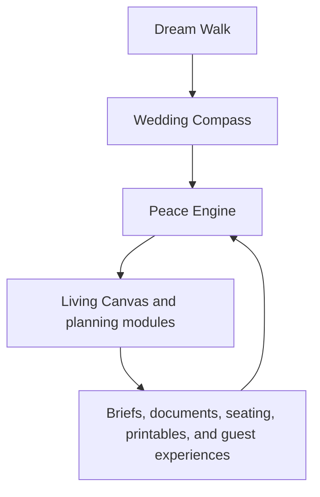

# The Missing Peace

## One Engine Redesign and Implementation Plan

**Product:** The Missing Peace Wedding Planning Engine  
**Scope:** Full product redesign from Dream through planning, collaboration, and outputs  
**Reference implementation:** Live GitHub product, user facing prototype archive, Feast Studio redesign plan, and Atmosphere Lab and Atelier brief  
**Design standard:** A romantic creative playground that quietly produces a practical, trustworthy wedding plan  
**North star:** **Build the world your love will walk into.**

## 0. Revised source of truth and implementation strategy

This revision reconciles four sources. The private GitHub repository at `kiddsiid/themissingpeace` is the source of truth for the actual product architecture and current implementation status. The uploaded archive remains the source of truth for the user facing prototype experience and its seeded visual storytelling. The Feast Studio redesign plan remains the source of truth for the meal planning workspace. The new Atmosphere Lab and Atelier brief supplies the deeper creative direction for the visual world and attire rooms.

The prototype and the live product should continue to exist at the same time, but they must have different responsibilities. The prototype is still user facing and should remain a beautiful showcase while the product is being built. It can use seeded data and simplified interactions to demonstrate the intended magic. The live product is the Next.js application in the repository, backed by Clerk, Supabase, Liveblocks, tldraw, Framer Motion, and the Peace Engine. Durable behavior, real collaboration, permissions, persistence, and production outputs belong in the live product.

This means the implementation plan is not a replatforming plan. The repository has already moved beyond the old standalone HTML architecture. The work now is to make the live product catch up to the prototype’s emotional and visual ambition while making the prototype and product share the same language, interaction concepts, fixture data, and domain vocabulary.

The two tracks should follow one feature loop:

| Stage | User facing prototype | Live product |
| --- | --- | --- |
| Imagine | Demonstrate the feeling with seeded Dream Clouds, visual previews, and guided room interactions | Persist Dream responses, Compass priorities, collaborators, and permissions |
| Shape | Demonstrate Poof, Bless, Ripple, Preview, and Ground with simplified state | Convert those actions into typed domain mutations, linked records, and event history |
| Decide | Show the emotional consequence of a choice | Write a real decision, dependency, risk, recommendation, or output update |
| Hand off | Preview the brief, website, seating, printables, or vendor-facing material | Generate the authoritative live object, version, export, or public guest surface |

The prototype should never imply that a seeded interaction is already persisted in the production system. The product should never sacrifice clarity or trust merely to reproduce a visual effect. Each prototype feature should have a named product counterpart, and each product feature should be represented in the showcase when it is important to the story.

### 0.1 Live repository status

The live repository already contains more infrastructure and product surface than the earlier ZIP snapshot suggests.

| Area | Current live state | Revised interpretation |
| --- | --- | --- |
| Application foundation | Next.js App Router, React, TypeScript, Tailwind, Cloudflare deployment paths | Preserve this stack. Do not rebuild the product as standalone HTML |
| Identity and workspaces | Clerk authentication, workspace membership, planner organization switching | Keep the product collaborative and workspace aware |
| Dream and Compass | Dream responses, Dream Clouds, persistent cloud priority, Compass approval | Deepen the model with module influence, ripple history, and versioning |
| Peace Engine | Deterministic rules plus Claude interpretation, planning runs, recommendations, risks, and Poof suggestions | Expand its context to guests, seating, Feast, Atmosphere, Atelier, and public outputs |
| Board | Gallery, Canvas, Liveblocks presence, uploads, favorites, attribution, tags, Poof, archive, and source links | Evolve Board into the Living Canvas without discarding the working board primitives |
| Master Vision | Automatically assembled from approved board items, mood extraction, Compass weaving, and presentation mode | Use it as the first World view, then enrich approved items into structured visual objects |
| Planning modules | Money Map, vendors, decisions, timeline, documents, playlist, honeymoon, and Peace Notes surfaces exist | Connect each module to the same Compass, decisions, dependencies, and output state |
| Guest surfaces | Guest CRM, public website, public RSVP, contact collection, guest photo album, and Website Studio exist in the handoff | Keep guest facing surfaces in the product roadmap. They are core, not a future private preview only |
| Seating | Reception and ceremony charts, tables, assignments, household seating, drag interactions, and capacity handling exist | Make it mobile first, add Peacekeeper suggestions, room objects, print export, and conflict explanation |
| Creative studios | The prototype has the richer Feast, Atmosphere, and Atelier concepts; the live repository is currently strongest around Board and Master Vision | Promote the three studios into structured live product workspaces with shared state |
| Collaboration | Liveblocks presence is active on the Board; workspace and role foundations exist | Extend object presence, comments, optimistic updates, and conflict handling across important modules |

### 0.2 Scope correction from the live handoff

The earlier plan treated the public Guest Experience as private preview only. The current repository handoff records a later owner decision that guest facing surfaces, public RSVP, and guest photo uploads are core to the product’s attempt to become planning.wedding on steroids. This revision therefore keeps the public Wedding Website, RSVP, contact collection, and guest photo album in the live product roadmap. The prototype can showcase them now, while the live product continues to harden publication gates, privacy, moderation, and mobile behavior.

The boundaries that remain firm are different. Vendors are still tracked as records rather than invited into a vendor portal. Money Map remains advisory and does not process payments. Private Peace Notes remain outside engine scoring and analytics. Public guest pages are allowed because the live handoff explicitly includes them, but they must expose only intentionally published content and remain scoped to the correct workspace.

## 1. Executive decision

The Missing Peace should become one connected wedding planning engine, not a collection of romantic pages with a common header. Dream is the opening feature. It gathers what the couple wants the day to feel like, converts those wishes into a Wedding Compass, and gives the Peace Engine a durable set of priorities to carry through every decision.

The Living Canvas remains the hero interface, but it is not the underlying product. It is the creative surface where the couple can see, shape, and feel the wedding world. The engine underneath it connects the Compass to guests, budget, vendors, timeline, seating, documents, private notes, the guest experience preview, and generated printables. Every module should read from the same project model, write back to that model, and explain what changes elsewhere when a meaningful choice is made.

The product should feel intimate before it feels technical, visual before it feels administrative, and trustworthy before it feels magical. Poetry should invite the decision. The interface should then make the consequence clear.

The prototype and live product already contain the raw ingredients: Dream Clouds, Wedding Compass, Peace Center, Board, Master Vision, Poof, Decisions, Money Map, Vendors, Guests, Seating Studio, public Website, Printables, Documents, Playlist, Honeymoon, Peace Notes, and the three creative room concepts of Feast, Atmosphere, and Atelier. The redesign does not need more top level features. It needs one model, one navigation system, one intelligence layer, one set of interaction rules, and a disciplined path for moving showcase ideas into durable product behavior.

## 2. The product model

The product has four layers. They should be visible in the experience, but they should not become four separate applications.

| Layer | Meaning | Primary surface |
| --- | --- | --- |
| Dream | What the couple wants to feel, protect, remember, and avoid | Dream Walk and Dream |
| Compass | The durable interpretation of those wishes | Wedding Compass |
| Engine | The intelligence, dependencies, readiness, and next actions derived from the Compass and project data | Peace Center and contextual Peace Panel |
| World | The creative plan and practical outputs created from the shared model | Living Canvas, planning modules, and outputs |

The central relationship is:



The feedback loop matters. A palette change should update the visible world. A guest requirement should update meal coverage, seating context, the caterer brief, and a Peace Engine action. A decision about the meal should update the budget, timeline, vendor questions, and related printables. The product should never ask users to manually repeat the same decision in multiple pages.

## 3. What the current build gets right

The emotional vocabulary is strong. The phrases “Your Dream Clouds,” “Your Compass has found its words,” “Build the world your love will walk into,” “what should the day taste like,” and “the private emotional layer” establish a distinct point of view. That voice should remain.

The prototype state model is also a meaningful visual foundation. `wedding-state.js` demonstrates the intended richness through dreams, a wedding profile, guests, food scenes, restrictions, attire looks, vendors, budget categories, documents, notes, and notifications. The live product has already replaced that local storage approach with Supabase backed records, Clerk workspaces, server actions, and Liveblocks for Board presence. The redesign should preserve the prototype vocabulary while mapping its seeded objects to the live domain model rather than creating a second production state store.

The Feast Studio plan adds the right operational discipline. Its three zone model, Feast Map, Tasting Canvas, and Peace Panel should become the pattern for the entire product. Progressive disclosure, explicit loading and recovery states, real routes, derived projections, mobile first collaboration, WCAG 2.2 AA, and advisory financial guidance are not Feast specific rules. They are product rules.

The homepage and Dream Walk are closest to the intended magic. They should become the emotional standard for every surface after the user enters the application.

## 4. What is currently preventing the product from feeling like one engine

The uploaded prototype contains repeated navigation and repeated page shells across many standalone HTML documents. That structure is acceptable as a temporary showcase artifact, but it should not be mistaken for the live architecture. The live repository has already moved to a Next.js application with server actions, Supabase tables, Clerk workspaces, Liveblocks collaboration, and an engine layer. The live product still needs a stronger shared domain layer, route state, derived selectors, mutation events, dependency records, and consistent action language across its modules.

The `Board.html` experience is doing too much at once. It contains the Design Studio, the Feast Studio, the Atmosphere Lab, and The Atelier in one very large implementation. That is why it feels like a polished dashboard even when the copy is emotional. The user is being asked to manage identity chips, emotion chips, guest coverage, courses, restrictions, presentation notes, palette swatches, and attire fields in a single long surface. The new Board should remain the doorway to the three studios, but each room needs its own spatial grammar and focus.

The current `WeddingState.peaceScore()` measures Compass approval, timeline status, settled decisions, budget status, booked vendors, and signed documents. It does not measure whether the couple understands their most important choices, whether guests are cared for, whether the plan is feasible, or whether the creative world is coherent. A single score that ignores the signature experience will feel decorative rather than intelligent.

The current mobile script primarily adds drawer swipe behavior. It does not create a mobile interaction model. The redesign must treat mobile as a first class composition with a dedicated shell, bottom navigation, full screen modes, bottom sheets, sticky actions, safe area support, and vertical alternatives to every horizontal or desktop only interaction.

The live Website surface already includes public guest website publishing, RSVP, contact collection, and guest photo uploads. The product must keep those capabilities, but place them behind explicit publication gates, workspace scoped loaders, content visibility controls, moderation, and clear preview versus live states. The prototype should showcase the guest experience while the live product hardens the public surface.

The current prototype also contains visible unresolved template expressions in some rendered states. The new implementation must include a build check that fails when unresolved interpolation tokens such as `{{ ... }}` reach the user interface.

## 5. The Wedding Compass is the product contract

Dream should not simply produce a sentence and a collection of floating clouds. It should produce a structured Wedding Compass that every module can use without asking the couple to repeat themselves.

The Compass should preserve both the poetic meaning and the practical interpretation. For example, “one long, generous table” should remain a human phrase, but the engine should also understand that it may imply family style service, a long table or grouped long tables, communal presentation, higher service coordination, a shared meal narrative, and seating decisions that prioritize household and family proximity.

The Compass should contain the following domains:

| Compass domain | Examples | Downstream influence |
| --- | --- | --- |
| Feeling | Warm, intimate, playful, peaceful, dramatic | Atmosphere, music, language, lighting, website preview |
| People | Family centered, community centered, private, intergenerational | Guest experience, seating, meal, timeline |
| Hospitality | Everyone included, thoughtful alternatives, abundant, relaxed | Feast coverage, service style, signage, vendor brief |
| Meaning | Faith, culture, memory, place, ancestry, ritual | Notes, ceremony, food stories, attire, playlist |
| Boundaries | No owner dependency, no performance, no alcohol, no late night pressure | Decisions, vendor questions, risk flags, timeline |
| Practical shape | Guest estimate, date confidence, location, budget guidance, planning stage | Timeline, Money Map, vendor readiness, document deadlines |

Each Compass item needs an identifier, a human phrase, a normalized code, its source, its strength, and the modules it influences. It should also have an explanation written in plain language. Users should be able to ask, “Why is this influencing my meal plan?” and get a useful answer.

The Compass is not locked forever. Approval means the couple agrees that it represents the current direction. It can be revisited, versioned, and changed. When a major Compass item changes, the Peace Engine should show a ripple preview before applying recommendations.

## 6. Dream and Dream Walk redesign

Dream Walk should be the ceremonial entrance into the product. It should not feel like a generic onboarding questionnaire. It should feel like the first room in the world the couple is creating.

The flow should ask only questions that can change a meaningful recommendation. The current season, light, intimacy, and feeling questions are good foundations, but each answer needs visible consequence. After each choice, the user should see a small Dream Cloud appear and a sentence explaining what that choice may shape.

The recommended sequence is:

1. Choose the shape of the gathering, from intimate to expansive.
2. Choose the light or time of day that feels like the day.
3. Choose the emotional center, such as family, adventure, faith, calm, celebration, or cultural continuity.
4. Choose the kind of hospitality the couple wants guests to remember.
5. Add freeform dreams, boundaries, people, traditions, and non negotiables.
6. Review the generated Compass and approve it together.

The system should allow the couple to skip a question, return to it later, or keep an answer as a dream without turning it into a task. The product should not punish uncertainty. A dream can remain open.

At the end of Dream Walk, the couple sees a Compass composition with a sentence, a few highlighted Dream Clouds, a first recommended next action, and a preview of the modules that will be shaped. For example: “Because you chose a family centered, warm, communal celebration, we prepared a shared table meal shape, a long table seating starting point, a candlelit atmosphere direction, and a planning watch list for guest care.”

The Dream page should then become the place to manage the Compass. Users can drag a cloud toward the center to raise its priority, mark a cloud as Real, return it to Dreaming, add a reflection, or connect it to a planning decision. The act of making something real should create a visible record in the project, not just change a decorative status.

Every realized Dream Cloud should show its ripples. A card might say: “Family and our people is influencing Feast, Seating, Timeline, Playlist, and Peace Notes.” Selecting the card opens the affected modules, not a dead end.

## 7. The Peace Engine

The Peace Engine is the intelligence layer. It should answer three questions continuously:

1. What is the couple trying to protect?
2. What is currently at risk or unresolved?
3. What is the most helpful next action?

The engine should combine deterministic rules with optional generated guidance. Deterministic rules handle dependencies, missing data, coverage conflicts, budget arithmetic, timeline ordering, vendor status, and document deadlines. Generated assistance can summarize a plan, propose drafts, explain a pattern, or suggest language, but it must never silently create a confirmed fact or override user authored decisions.

The Peace Engine should produce four primary projections:

| Projection | Purpose |
| --- | --- |
| Next action | One recommended step that can be completed or intentionally deferred |
| Watch list | Risks and unknowns that need attention, with evidence and an owner |
| Ripple map | The modules affected by a meaningful change |
| Readiness | A view of whether the current plan is understandable, cared for, feasible, and ready to hand off |

Replace the current broad Peace Score with a Peace Readiness model. Keep the top status pill because it is part of the product language, but make the underlying model more honest.

| Readiness dimension | What it measures |
| --- | --- |
| Clarity | Compass approved, major decisions understood, key facts known |
| Care | Guest requirements represented, meal coverage assessed, conflicts resolved or acknowledged |
| Feasibility | Venue, service, staffing, budget guidance, timing, and vendor questions are coherent |
| Alignment | Partners and collaborators have approved or commented on meaningful choices |
| Handoff | Briefs, documents, timeline, seating, and generated outputs are complete enough to use |

Each dimension should show a score, a plain language explanation, and the open items that influence it. The score should never imply that an allergy or religious requirement is “safe” because a checkbox was selected. Confidence states need to be explicit.

The engine should create human readable decision records whenever a meaningful action changes the project. Examples include: “Changed the Main Course from plated to family style,” “Added a separate certified kosher meal as an open vendor requirement,” “Protected catering in the Money Map,” or “Accepted the last dance as the closing moment.”

### 7.1 The live Peace Engine gap

The repository already has a working engine runner. `src/lib/engine/run.ts` loads wedding profile, Compass, budget items, categories, vendors, tasks, decisions, Board items, and documents; it derives deterministic facts and risks; it calls the Peacekeeper; and it persists planning recommendations and risks. This is a strong foundation, but it is not yet the complete one engine described by the prototype.

The next engine revision should add structured context for guest households and requirements, seating charts and conflicts, Feast scenes and dish assessments, Atmosphere palette roles and surface applications, Atelier looks and harmony, public Website state, Printables freshness, Playlist moments, and vendor evidence. The engine should not infer these from freeform Board titles once structured records exist.

The Compass model in `src/lib/engine/compass.ts` already separates priorities, non negotiables, avoid items, cultural values, traditions, and tone. Extend it with stable principle identifiers, source Dream Cloud ids, confidence, linked module ids, and version history. The Board’s current mood extraction and “Weave into Compass” action should become one supported way to update the Compass, with a visible source and user approval.

The Board’s `Poof` workflow should become a typed bridge between inspiration and planning. A poofed fragment should retain its source Board item, creator, source URL or upload, inferred tags, chosen target, generated prefill, resulting entity, and status. The same concept should power prototype demonstrations and live mutations. The Peace Engine can suggest a Poof target, but the user must confirm it.

The first engine milestone is not a larger language model prompt. It is a complete, inspectable project context. The system should be able to explain: “This recommendation exists because of this Compass principle, this approved visual fragment, this guest requirement, and this unresolved planning object.”

## 8. Peace Center redesign

Peace Center should be the command center, not another dashboard of metrics. Its first screen should open with a calm summary of what matters now and a single next action.

The opening composition should contain a compact Compass statement, the current Peace Readiness status, the most important watch item, the next action, and a visual strip of recent ripples. Below that, the user can enter a focused module.

The engine should avoid presenting ten equal priority cards. The hierarchy should be:

1. The one thing worth doing next.
2. The one risk that deserves attention.
3. The current readiness story.
4. Recent decisions and their ripples.
5. A quieter overview of planning areas.

Every recommendation needs a reason. “Review catering agreement” is less useful than “Your menu direction is family style, but the current catering agreement still describes plated service. Review the service language before signing.”

Peace Center should support a focus mode. Selecting an action should open the relevant module in context, with the Peace Panel still available. The user should never lose the reason they entered a screen.

## 9. The Living Canvas and Design Studio

The Board should be renamed in the product language as the Living Canvas while the existing Design Studio label can remain as a supporting phrase. The Living Canvas is the visual surface where the couple shapes the world. It is not a place to store a second copy of the data.

The global structure should be:

| Zone | Purpose | Desktop | Mobile |
| --- | --- | --- | --- |
| Dream Drawer | Shows the Compass, inspirations, active dreams, and linked ripples | Persistent left rail | Full screen drawer or bottom sheet |
| Living Canvas | Active creative workspace for Feast, Atmosphere, or Atelier | Primary center surface | Full width room view |
| Peace Panel | Shows coverage, readiness, cost guidance, risk, and next action | Persistent right rail | Insights destination and contextual sheet |

The three rooms remain:

| Room | Promise | Signature interaction |
| --- | --- | --- |
| The Feast Studio | Build the meal every guest can enter, understand, and enjoy | Walk through the meal as a living table and guest care story |
| The Atmosphere Lab | Design the feeling before anyone says a word | Change one atmosphere decision and watch it ripple through the day |
| The Atelier | Design the story your love will wear | Compose looks in the context of the actual day |

The room selector should not be a crowded row of pills on mobile. It should be three room cards with a title, poetic promise, progress, and a clear action. Desktop can use a compact contextual switcher after the user enters the Living Canvas.

### 9.1 The Dream Drawer

The Dream Drawer contains Dream Clouds, saved inspirations, realized ideas, and the current Compass summary. An inspiration can be saved with a source, an optional note, a category, and a relationship to one or more rooms. “Poof this” should create a draft object with provenance. It should never overwrite an approved plan.

The Drawer should include a filter for All, Food, Atmosphere, Attire, Guest Experience, Ceremony, and Afterglow. Selecting an item should open the room or module where it can become real.

### 9.2 The Living Canvas

The center should feel like a creative workspace, not a long form. One primary object should occupy the visual center. In Feast, that object is the meal journey. In Atmosphere, it is the living day preview. In Atelier, it is the look composition and context preview.

The center should use staged interaction. First show the scene or object. Then reveal the decision controls. Then show the consequence. Avoid showing every field at once.

### 9.3 The Peace Panel

The Peace Panel should be useful before any generated image or preview is ready. It should show deterministic coverage, readiness, cost guidance, execution concerns, and the next action. Generated previews are secondary. If preview services fail, the plan remains usable.

## 10. The Feast Studio redesign

The Feast Studio is the signature wedge of the Living Canvas. It should feel like a tasting table, hospitality engine, and food journey. It must not feel like a menu administration screen.

The north star for the room is:

**Build a meal every guest can enter, understand, and enjoy.**

The room should open with the Feast Canvas rather than a list of dishes. The Feast Canvas represents the meal from arrival to sendoff:

Welcome drink, passed bites, grazing table, first course, main course, dessert, late night bite, tea or coffee, and sendoff treat.

Each scene is a moment in the day. It should have a purpose, mood, timing, service style, dish count, guest care signal, and readiness state. The user can reorder scenes, add a custom moment, intentionally leave a scene empty, or choose a template such as plated dinner, family style celebration, cultural feast, stations and grazing, brunch, cocktail reception, or intimate dinner.

On desktop, use the Feast Map on the left, the Tasting Canvas in the center, and the Peace Panel on the right. On mobile, use a vertical Feast Journey. A horizontal shortcut may show the previous, current, and next scene, but the complete meal must always be available as a vertical list.

Each dish card should show the dish name, why it belongs, who it cares for, compatibility and confidence, vendor verification needs, presentation direction, guest experience impact, and an advisory budget or complexity signal. The collapsed card should be quiet and scannable. The expanded card should reveal story, requirements, evidence, preparation notes, comments, and history.

Adding a dish should use four progressive steps: Basics, Guest Fit, Production, and Meaning. The first save needs only the scene, dish name, and role in the meal. Requirement assessment should not pretend to be complete before ingredients and preparation details exist. Suggestions create Draft dishes with a rationale and never overwrite confirmed data.

### 10.1 Guest Care Preview

The Guest Care Preview should be framed as hospitality intelligence. It should not merely display “partial,” “full,” or “none.” It should explain what the current plan provides, what is missing, why it matters, and what action will resolve it.

Examples of the intended language include:

“Your halal and alcohol free guests currently have a suitable welcome drink and soup, but the main course still needs a verified meat source or a fully satisfying alternative.”

“Your vegan and gluten free guests have a complete savory meal, but dessert still needs a separate plated option.”

“Kosher certified guests are not covered by the current menu unless certified meals are sourced separately.”

“Guests with a severe nut allergy need separate preparation, dedicated utensils, and clear labeling.”

The preview should show Covered, Needs review, and Conflict counts. Selecting a guest group should reveal the affected dishes and the next action. On mobile, Guest Care becomes a swipeable card stack or bottom sheet with one group visible at a time.

### 10.2 Hospitality Score

The Feast Studio should contain a Hospitality Score or Guest Care Meter. It should never be presented as a moral grade. It is a planning readiness signal built from:

| Signal | Meaning |
| --- | --- |
| Meal coverage | How many guest requirements have a plausible meal path |
| Confidence | How many assessments are known, ingredient compatible, vendor confirmed, or documented |
| Verification readiness | Whether required evidence and preparation questions exist |
| Presentation completeness | Whether the plan explains how the care will be visible and dignified |
| Menu story strength | Whether the meal expresses the approved Compass without creating execution confusion |

The score should sit beside a plain language summary such as “The meal is generous and emotionally coherent. Two care requirements still need vendor confirmation.”

### 10.3 Requirement language

Replace ambiguous flat chips with requirement, assessment, evidence, and preparation layers.

| Requirement | Correct interpretation |
| --- | --- |
| Halal compatible ingredients | Ingredients may be compatible, but meat source and preparation still need confirmation |
| Zabiha | Verified slaughter source is required |
| Kosher style | Not kosher certified and cannot satisfy a certified requirement |
| Kosher certified | Sourcing, preparation, supervision, or qualifying evidence is required |
| Gluten free | Ingredient claim only until preparation and cross contact controls are confirmed |
| Celiac requirement | Cross contamination controls, separate preparation, and clear service handling are required |
| Allergy requirement | Separate preparation, labeling, and vendor confirmation are required |

Use the assessment states Unknown, Ingredient compatible, Vendor confirmed, Certification documented, and Conflict. Never use “safe” as a universal status.

### 10.4 Caterer brief

The Caterer Brief is a live projection from the Feast Plan. It should include event facts, meal intention, service sequence, dishes, guest counts, requirements, preparation protocols, presentation notes, staffing assumptions, equipment, open questions, evidence, and decision history.

Version one remains advisory and private. It supports preview, internal comments, versioning, and PDF export. It does not include payment processing, a vendor portal, or a public sharing page. Vendors remain internal records. When the plan changes, the brief should show which sections are affected before generating a new version.

## 11. The Atmosphere Lab redesign

The Atmosphere Lab should be an atmosphere control room, not a palette picker. Its core promise is:

**Design the feeling before anyone says a word.**

The opening view should show the current atmosphere as a live day preview with a compact palette summary, emotional words, light direction, and an explanation of the current visual logic. Changing a color, light, material, or atmosphere word should immediately update a set of preview surfaces.

The preview surfaces should include invitation, wedding website preview, tablescape, attire, florals, cake, menu card, ceremony setting, reception lighting, and the private Peace Notes cover. The user should see a visible change when a decision changes. A color selection that only changes a swatch is not enough.

The Lab should produce practical guidance such as:

“Sage carries the calm and natural quality of your Compass. Clay adds warmth to the reception without competing with the candlelight. Keep the ink tone charcoal so the menu and invitation remain legible.”

The system should distinguish between palette tokens, surface applications, and exceptions. A user can apply a palette to the whole world, then override a surface intentionally. The engine should record the override and show where the world is no longer aligned.

On mobile, use a horizontal preview carousel with one surface visible at a time. Place the palette controls below the preview, not above a long row of chips. Use large touch targets and show the current surface name clearly.

### 11.1 Atmosphere system and MVP

The Atmosphere Lab should control the air of the wedding, not merely its colors. The emotional opening should ask, “What should the world feel like when people walk in?” The first interaction is a set of feeling words such as warm, sacred, airy, candlelit, lush, editorial, romantic, regal, earthy, coastal, celestial, modern, old world, whimsical, minimal, garden, dramatic, soft, joyful, and nostalgic. The user should see the chosen feeling direction influence the preview before the interface introduces technical color controls.

The palette object should become a visual language system with purposeful roles. At minimum, the live model should support primary, secondary, accent, neutral, metallic, texture, floral, lighting, stationery, attire, and food styling roles. Each role needs a color value, a human name, a mood interpretation, where it appears, vendor notes, and linked preview surfaces. The user should understand why a color exists instead of seeing a row of hex values.

The strongest action is **Ripple through the world**. Applying a palette should update invitation, private and public website styling where appropriate, ceremony setting, tablescape, attire context, florals, cake, menu cards, cocktail signage, bar menu, dance floor lighting, thank you card, Feast presentation notes, and Atelier suggestions. The user may override one surface intentionally, but the engine should record that exception and explain where the world is intentionally different.

The Atmosphere Lab should include a Palette Journey Timeline because the wedding can evolve across the day. Getting ready, ceremony, cocktail hour, reception, and afterparty may each have a related but distinct visual expression. The journey object should store the moment, palette role overrides, lighting direction, materials, and transition note. This produces a cinematic arc rather than a flat theme.

Inspiration color extraction should be designed as a supported future capability. A user should be able to upload or save a sunset, dress, room, painting, flower arrangement, venue, family memory, restaurant, fabric, or travel photo, extract a draft color system, and choose whether it becomes a ceremony palette, reception palette, floral palette, stationery palette, Feast palette, or full wedding atmosphere. The MVP can use manual color roles and curated suggestions first, but the object model should leave room for image extraction without redesigning the room.

The Lab needs design intelligence that gently critiques rather than dictates. Examples include: “This palette may photograph darker indoors unless the lighting stays warm,” “These colors are beautiful, but the number of accents may make the design feel busy,” or “Your food presentation uses warm tones while the palette is cool and minimal. Wood, brass, or linen could bridge the two.” These notes should be explainable, dismissible, and connected to the source choices.

The visual language should feel like an editorial design studio with paper samples, fabric swatches, light washes, flower shadows, invitation previews, table linen, glass, stone, ceramic, and candlelight. The interaction should feel tactile without pretending that a color picker is a full design system.

Atmosphere outputs should include a named color system with hex values, a vendor palette brief, floral notes, fabric references, stationery styling, website theme, attire color guide, tablescape guide, menu and food presentation notes, photography lighting notes, seasonal adaptation notes, budget friendly substitutions, and a do not use color list. The first live MVP should ship emotional mood selection, layered palette roles, preview cards, Palette Journey Timeline, palette intelligence notes, and Ripple through the world. Advanced AI color extraction can follow after the shared state and preview surfaces are trustworthy.

## 12. The Atelier redesign

The Atelier should feel like a fashion studio, not a set of basic look cards. Its promise is:

**Design the story your love will wear.**

The current look composer can remain as a foundation, but it should become a guided composer with context. The user should choose who is being styled, then shape silhouette, fabric, color, accessories, formality, modesty, movement, and weather or venue needs.

Every look should be previewable in the context of the actual day: aisle, portraits, reception lighting, dance floor, beside partner, beside the wedding party, and against the approved palette. If photorealistic or 3D previews are not available, use illustrated context cards with clear Beta labeling. Do not present a mannequin placeholder as finished intelligence.

Couple Harmony should explain the relationship between the two primary looks. It should identify whether they feel beautifully balanced, too formal, too casual, visually disconnected, or aligned with the Compass. Wedding Party Harmony should show color, formality, silhouette, and movement relationships without requiring identical outfits.

Approval should remain collaborative and editable. The current hard coded approver labels such as Maya, Julian, and Aria must become project roles with editable names and labels. The product should use the couple’s chosen labels rather than assuming bride and groom.

On mobile, use a guided Look Composer with one decision group visible at a time and swipeable context previews. Avoid attempting a dense 3D editor inside a normal scrolling page.

### 12.1 Atelier system and MVP

The Atelier should be a wardrobe system for the entire wedding world. Its opening should ask, “Who are we dressing for this world?” The selector should support the couple, partners, wedding party, parents, flower girl, ring bearer, guests, reception look, afterparty look, rehearsal dinner look, cultural ceremony look, and honeymoon sendoff look. This keeps the room from collapsing the wedding into one dress and one suit.

The Look Composer should guide the user through garment type, silhouette, fabric, color, texture, accent, accessories, shoes, jewelry, veil or headpiece, bouquet pairing, modesty preferences, cultural notes, religious considerations, seasonal comfort, movement comfort, weather compatibility, and formality. Garment options must be culturally aware and broad enough to include gowns, suits, tuxedos, sherwanis, lehengas, kaftans, abaya inspired formalwear, jumpsuits, capes, veils, robes, cloaks, two piece formalwear, and custom cultural attire. The product should not force one Western fashion vocabulary onto every wedding.

The first live implementation should be a 2.5D fashion studio rather than full 3D or AR. Use stylized silhouettes, mannequin cards, fabric swatches, color overlays, accessory chips, and context previews. This creates depth without creating a complex fashion CAD product. Rotatable models, body shape customization, fabric movement, and AR previews remain later opportunities.

Couple Harmony View is a core decision surface. It should place both partners side by side against the approved palette, venue mood, floral tone, and selected lighting. The guidance should be specific: “These looks feel beautifully aligned,” “One look reads formal while the other feels relaxed,” or “The bride’s look is romantic garden while the groom’s styling reads modern black tie. Consider softening the accessories or deepening the palette.” The point is not to judge taste. It is to reveal relationships that are difficult to see in isolated look cards.

Wedding Party Harmony View should support same color with different silhouettes, a shared fabric family, gradient palettes, tonal mixing, pattern with solids, individual personality within a shared dress code, and cultural fusion. The output should show harmony rather than demand identical clothing.

Context Preview should let users test attire in the ceremony aisle, portraits, reception lighting, dance floor, dinner setting, beside the partner, beside the wedding party, against the palette, and against floral design. This is the product’s practical version of a four dimensional feeling. The look is evaluated across movement, context, time, lighting, and emotional use.

Attire Rules and Sensitivities should capture modest dress preferences, hijab styling notes, cultural attire inclusion, no white for guests, black tie or garden formal expectations, color restrictions, family traditions, religious setting expectations, comfort needs, and weather needs. The system should produce guest facing dress code language, visual examples, do not wear guidance, color guidance, formality expectations, a website version, and a shorter invitation version.

Atelier outputs should include a couple harmony board, wedding party attire guide, guest dress code copy, tailor or designer brief, shopping list, color and fabric guide, do not wear guide, cultural attire notes, modesty notes, reception change notes, weather comfort notes, and a wedding party approval tracker. Each look should be a structured live object with person or group, garment type, silhouette, fabric, color, accent, mood tags, modesty notes, cultural notes, formality, linked palette colors, linked floral notes, and status.

The first live Atelier MVP should ship Look Selector, Look Composer, Couple Harmony View, Wedding Party Harmony View, guest dress code generator, attire rules, and context preview cards. The mobile version should use a guided sequence: choose person, choose garment direction, choose fabric and color, choose accessories and notes, preview in context, and Bless the look.

### 12.2 Studio connection examples

The Atmosphere Lab defines the visual language, The Atelier dresses the people inside it, and The Feast Studio creates the table inside the same world. If the Atmosphere Lab creates a candlelit espresso, cream, burgundy, and champagne world, Atelier can suggest velvet, satin, black tie, pearl, gold, and deep floral accents while Feast can suggest warm menu cards, brass signage, berry garnishes, espresso toned desserts, and refined plating.

If the Atmosphere Lab creates an airy garden palette with ivory, sage, soft rose, and champagne, Atelier can suggest flowing fabrics, tonal wedding party looks, garden formal guest guidance, and softer accessories while Feast can suggest herb forward presentation, citrus, floral menu cards, ceramic platters, and lighter seasonal courses. These are not hard coded themes. They are explainable recommendations grounded in shared palette roles and Compass priorities.

## 13. Planning modules as connected projections

The remaining modules should feel like different views of the same wedding world. They should not be forced into the same visual composition as the three studios, but they must use the same shell, domain model, actions, statuses, and ripple language.

| Existing surface | Redesigned role | Reads from | Writes back |
| --- | --- | --- | --- |
| Homepage | Emotional front door and identity selection | Project invitation or new project state | Selected participant role |
| Dream Walk | Guided origin story and Compass creation | Dream answers and project profile | Compass, Dream Clouds, first watch list |
| Dream | Compass editor and Dream Cloud map | Compass and clouds | Priorities, realized dreams, linked intentions |
| Peace Center | Command center | All derived projections | Action completion, decision focus, dismissal or acceptance |
| Board | Living Canvas doorway | Compass, inspirations, progress | Room selection and creative drafts |
| Feast Studio | Meal journey and hospitality intelligence | Guests, requirements, Compass, vendors, budget | Scenes, dishes, assessments, evidence, brief versions |
| Atmosphere Lab | Live visual world | Compass, palette, materials, rooms | Palette tokens, surface applications, exceptions |
| The Atelier | Contextual attire studio | Compass, palette, venue, season, party | Looks, approvals, attire requirements, harmony notes |
| Decisions | Decision ledger and rationale | Engine recommendations and linked objects | Options, votes, rationale, final decisions |
| Money Map | Advisory financial model | Vendors, decisions, guest estimate, modules | Guidance, protected categories, assumptions, scenarios |
| Timeline | Planning roadmap and Run of Day | Date, venue, vendors, decisions, meal, music | Milestones, tasks, dependencies, day sequence |
| Vendors | Internal vendor records | Compass, module needs, documents, budget | Vendor status, contact notes, open questions, evidence |
| Guests | Guest CRM and care model | RSVPs, households, requirements, meals | Guest facts, attendance, meal requirements, travel notes |
| Seating Studio | Seating graph and arrangement mode | Guests, households, VIPs, requirements, venue tables | Table plan, assignments, conflicts, exceptions |
| Website | Public guest experience and private Website Studio | Compass, website content, timeline, menu, attire, Master Vision | Published page, RSVP, contact collection, guest photo album, moderation, and publication readiness |
| Printables | Generated paper outputs | Guests, seating, menu, timeline, Compass | Export versions and stale state |
| Documents | Private document vault | Vendors, briefs, agreements, generated exports | Status, signers, deadlines, notes, versions |
| Playlist | Soundtrack by moment | Compass, timeline, guest requests | Tracks, requests, hard no list, moment associations |
| Honeymoon | Afterglow planning space | Preferences, budget guidance, notes | Destination, wishes, itinerary drafts |
| Peace Notes | Private emotional layer | Dream, people, memories, rituals | Letters, vows, poems, sealed notes, optional links |

### 13.1 Decisions

Decisions should become the connective tissue between intention and execution. Every major decision should show its linked Dream Cloud, the options considered, who has participated, the current state, the reason, and the modules it affects.

The user should be able to open a decision from Peace Center, Feast, Money Map, Timeline, or Vendors and return to the same decision record. Settling a decision should create a ripple summary. Reopening it should show which downstream objects may become stale.

### 13.2 Money Map

Money Map should remain advisory. It should show funds, planned commitments, paid amounts, scheduled amounts, protected categories, and assumptions. It should not process payments or imply that the product is a financial institution.

Every number should be traceable to a source. A catering estimate should link to the caterer record or a user entered assumption. A guest count change should show its effect on catering guidance, rentals, seating, printables, and potentially the budget. Scenario mode should let the couple compare choices such as family style versus plated without silently changing the approved plan.

### 13.3 Timeline

Timeline should contain two connected views. The Planning Roadmap carries the couple to the day. The Run of Day carries the team through the day. Dependencies should be generated from decisions, vendors, documents, meal service, music moments, and venue constraints.

The system should explain dependencies in plain language. “Catering agreement waits on meal service decision” is useful. “Task 12 depends on item 7” is not.

When a date is still a dream, the user should see a draft roadmap with date independent tasks. Setting a date should unlock the Run of Day and convert relative tasks into due dates.

### 13.4 Vendors

Vendors remain internal records in version one. Users can record a vendor, category, status, quote, fit, contact notes, open questions, requirements, and linked documents. A vendor record should show what the project expects from that vendor, based on the Compass and connected modules.

The vendor view should identify gaps such as: “The current caterer record has no evidence for the Zabiha requirement,” “The venue has not confirmed separate preparation space,” or “The photographer is not yet linked to the Run of Day.” The product should generate a brief or export that the user can share outside the system, but it should not require the vendor to create an account.

### 13.5 Guests

Guests should be the source of truth for people, households, attendance, meal requirements, travel notes, and seating context. Feast should read requirements from Guests rather than asking users to duplicate them in a separate restriction editor.

The Guest view should support filters for RSVP state, household, travel, meal needs, seating conflicts, and unresolved care requirements. A guest profile should show their affected dishes and seating context. Changes to a guest requirement should create a visible ripple in Feast, Seating, Printables, and the Peace Engine.

### 13.6 Seating Studio

Seating is a specialized spatial tool and deserves an immersive mode. On desktop, the map can remain a large canvas with a guest drawer. On mobile, it must open as a dedicated Arrange Mode rather than a normal page.

Arrange Mode includes a compact top toolbar, reception or ceremony toggle, seated count, Magic Arrange, add table, reset, undo, and a full screen map. A bottom sheet contains searchable guests and households with filters for family, friends, requirements, conflicts, and VIP status. Users can drag a guest from the drawer to a seat, tap a table to edit, pinch to zoom, and long press to move a guest.

Magic Arrange must be advisory. It should explain its priorities, show conflicts, and require confirmation before committing. The engine should not group guests by sensitive requirements in a way that could expose private information or create social harm. Dietary information may influence meal logistics and alerts, but it should not dictate social seating without user intent.

### 13.7 Website and Guest Experience

The live Website surface should remain a public guest experience generated from the same Compass and project data. It can render the couple’s story, details, travel information, dress code, menu direction, registry notes, RSVP flow, and guest photo album. The private Website Studio is where the couple edits the content, preview states, slug, toggles, publication status, and photo moderation.

The public system must be deliberately narrow. The public loader should expose only fields intended for guests, and every write must verify that the page is published, the relevant feature is open, and the request is scoped to the page’s workspace. RSVP should search by invitation or household, write accepted meals and dietary information into the Guest CRM, collect address updates through the contact collector, and pass song requests into Playlist. Guest photo uploads should remain image only, size limited, stored privately, served through signed URLs, and moderated by the couple.

The product needs explicit Draft, Preview, Published, Unpublished, RSVP open, RSVP closed, Photos open, Photos closed, and Needs update states. A change to the Master Vision, Timeline, dress code, or menu should show which public sections are affected. The user should be able to preview the change before publishing it. Version one does not need a vendor portal or public planning workspace, but it does need a credible public guest surface because that is now a core product decision in the live handoff.

### 13.8 Printables

Printables should be generated from the current model. Escort cards read from Guests and Seating. Menu cards read from Feast and requirements. Day of cards read from Timeline. Save the Date reads from the Compass and wedding facts.

Every printable needs a source summary and a stale state. If the table plan changes after an export, the system should say “Update available” and identify the affected output. Users should not have to remember which documents are out of date.

### 13.9 Documents

Documents should become a private vault with clear states: Draft, Awaiting internal signature, Signed, Shared externally, Expired, or Needs update. The current mobile overflow problem should be removed by stacking document content and moving secondary actions into an overflow menu.

The system can keep internal signer records and export or share actions, but version one should not depend on an external vendor portal. The document view should connect each file to its vendor, budget category, decision, deadline, and affected modules.

### 13.10 Playlist

Playlist should be organized by moment rather than presented as an isolated list of tracks. First dance, ceremony, cocktail hour, dinner, dance floor, last dance, and sendoff should connect to Timeline and the Compass mood. Guest requests and hard no items should remain visible, with ownership and approval states.

### 13.11 Honeymoon

Honeymoon can remain a distinct emotional room, but it should be framed as Afterglow rather than another core planning dashboard. It should inherit the couple’s mood, pace, and budget guardrails, while remaining separate from the wedding day Peace Readiness score. Wishes can come from Peace Notes or the Compass, but the user should not be forced to plan the honeymoon before the wedding foundation is clear.

### 13.12 Peace Notes

Peace Notes should remain the private soul layer. Notes, poems, letters, vows, memories, and gratitude should never be used as analytics or readiness inputs unless the user explicitly links a note to a project area. Sealing behavior should be local to the note and clearly explained. A note can optionally become a ceremony line, website story, or private day of prompt, but the default is private.

## 14. Ripple behavior

The product will feel like one engine only when changes visibly travel. A ripple should have a source, affected objects, the reason for the effect, and the user’s choice to accept, review, or dismiss the recommendation.

| User change | Engine response |
| --- | --- |
| Dream says “one long, generous table” | Recommend family style Feast template, long table seating, communal presentation, service staffing review, and related rental guidance |
| Guest adds certified kosher requirement | Update Guest Care, mark affected dishes Unknown or Conflict, create a vendor evidence action, flag the brief, and show seating or meal privacy considerations |
| User changes the palette from sage to plum | Update invitation, private website preview, tablescape, attire context, florals, cake, menu card, and lighting previews |
| User changes family style to plated | Update Feast service assumptions, staffing, rentals, timeline, catering decision, vendor brief, and Money Map scenario |
| Date is set | Convert roadmap tasks to dates, create Run of Day scaffolding, update vendor deadlines, document due dates, and refresh published or preview guest facts |
| Guest count rises | Recalculate advisory food and beverage guidance, rentals, seating capacity, printables, and relevant vendor questions |
| Vendor is marked booked | Update Money Map, document checklist, timeline dependencies, and Peace Readiness |
| Main look is approved | Update Atelier Harmony, palette alignment, portrait context, website preview, and associated decision history |
| A brief version is created | Freeze a snapshot, record changed sections, and flag the brief when source data changes |

The user should never be surprised by a change in another module. A small “This will ripple into…” preview before applying a major change will make the engine feel trustworthy.

## 15. Navigation and application shell

The desktop shell should have one global header and one contextual navigation system. Do not repeat a full navigation rail inside every page implementation.

The global desktop header contains the brand, project name, current Peace status, collaborator presence, save state, notifications, and account or project controls. The main navigation should be organized by the user’s mental model, not by every route:

| Group | Destinations |
| --- | --- |
| Begin | Dream, Compass |
| Create | Living Canvas, Feast, Atmosphere, Atelier |
| Plan | Peace Center, Decisions, Timeline, Money Map |
| People and partners | Guests, Seating, Vendors |
| Outputs | Briefs, Documents, Printables, Guest Experience |
| Soul and afterglow | Peace Notes, Playlist, Honeymoon |

The current route should be announced, and all navigation destinations should be real links. Deep linking, browser history, refresh, and back behavior are required.

Mobile should use the following core navigation:

**Home, Dream, Studio, Guests, Peace**

Secondary modules belong in a full height More drawer: Timeline, Money Map, Vendors, Documents, Seating, Guest Experience, Printables, Playlist, Honeymoon, Notes, and project settings.

Inside Studio, use a compact room selector for Feast, Atmosphere, and Atelier. Inside Feast, use Flow, Dishes, Guests, and Brief. Do not create two permanent bottom navigation bars.

The mobile top bar should contain a menu button, short brand mark, collaborator presence, and a compact Peace status. The “Wedding Planning Engine” label can move into the menu on narrow screens. All actions must account for safe area insets.

## 16. Mobile first interaction model

The mobile experience must be designed independently from the desktop layout. It should work at 375 pixels, 390 pixels, 414 pixels, and 430 pixels without horizontal scrolling or clipped actions.

Use a 56 pixel top bar plus safe area, a bottom navigation of 64 pixels plus safe area, and a single content column. Side panels become full screen drawers, bottom sheets, or dedicated Insights screens. Long desktop tables become filterable lists with a detail view. Secondary controls move into overflow menus.

The Feast Studio uses a vertical Feast Journey and sticky Add Dish action. The Guest Care Preview becomes a bottom sheet or swipeable stack. The Seating Studio uses full screen Arrange Mode with a collapsible guest drawer. Documents stack title, status, signers, due date, and action. Atmosphere uses a swipeable preview carousel. Atelier uses a guided composer and context cards. Printables use a preview first, then an export action.

Do not hide broken desktop layouts behind `overflow-x: hidden`. Treat overflow as a test failure. Use `box-sizing: border-box`, maximum width constraints, responsive type with `clamp`, one column grids below the mobile breakpoint, and safe area padding.

Every tap target must be at least 44 by 44 pixels. Sticky footers must remain above the keyboard. Any full screen sheet must have a named heading, a close action, focus behavior, and a predictable back gesture.

## 17. Visual system

The visual system should preserve the soft editorial wedding aesthetic while making the product more legible and alive.

| Token | Value | Use |
| --- | --- | --- |
| Canvas | `#F7F4EE` | Application background |
| Surface | `#FFFDFC` | Cards, sheets, and work areas |
| Ink | `#201C18` | Primary text |
| Muted ink | `#6D645B` | Secondary text |
| Brass text | `#7A531A` | Accessible accent text |
| Brass | `#A8782A` | Borders, icons, selected accents |
| Candle | `#F2B134` | Warm highlight only |
| Sage | `#2F6D55` | Confirmed and positive states |
| Warning | `#9A5716` | Needs confirmation |
| Danger | `#A23B32` | Conflicts and destructive actions |
| Border | `rgba(32, 28, 24, 0.14)` | Default boundaries |

Use Cormorant Garamond for display and Manrope for interface text. Italic serif belongs to intentions, quotes, stories, and emotional moments. It should not carry essential form instructions. Use accessible brass text for important labels and never rely on pale gold alone for meaning.

The product should move away from oversized empty hero cards and repeated card grids. Use editorial compositions, scene transitions, layered paper or canvas surfaces, meaningful whitespace, and visual previews that respond to choices. The central surface should feel alive because it changes, not because it is covered in animation.

Motion should explain state change: a cloud becoming real, a dish moving through the meal, a coverage state updating, a palette rippling through previews, a panel opening, or a brief gaining a new version. Respect reduced motion. Functional transitions should remain quick.

## 18. Shared component architecture

The live product is already a route aware Next.js application. Do not replatform it again. Continue consolidating the product inside the existing App Router, while keeping the old standalone HTML prototype as a separately deployed user facing showroom. No new durable feature should be implemented only in the prototype. No live feature should create a second business logic path that cannot be represented in the prototype when it is part of the showcase story.

The live architecture should remain Next.js App Router with React and TypeScript, Supabase for persistence, Clerk for identity and workspaces, Liveblocks for realtime collaboration, tldraw for spatial surfaces, Framer Motion for motion, Zod for validation, Zustand where local cross component state is genuinely needed, and the existing server action pattern. The prototype’s custom declarative runtime and `wedding-state.js` should remain a showcase adapter only. Its seeded state should mirror product fixtures and action names, but it should not become a second production database.

Recommended structure:

```text
app/
  (app)/
    board/
    dream/
    peace-center/
    guests/
    seating/
    budget/
    vendors/
    decisions/
    timeline/
    documents/
    playlist/
    honeymoon/
    website/
    printables/
  w/
    [slug]/
  api/
src/
  components/
    board/
    seating/
    playlist/
    print/
    collaboration/
  lib/
    engine/
    board/
    seating/
    guest-page/
    workspace/
    supabase/
    money-map/
prototype/
cloudflare-prototype/
supabase/migrations/
tests/
```

The live product should keep business logic in typed domain helpers, server actions, engine modules, and shared selectors. The prototype `WeddingState` should act only as a showcase adapter over equivalent semantic concepts. Individual live pages should not mutate nested objects directly. They should call named actions such as `addDreamCloud`, `approveCompass`, `changeMealShape`, `addDishDraft`, `recordAssessment`, `attachEvidence`, `setGuestRequirement`, `settleDecision`, `setVendorStatus`, `protectBudgetCategory`, `assignSeat`, or `createBriefVersion`.

The core shared components should include `AppShell`, `MobileBottomNav`, `ContextualNav`, `DreamDrawer`, `WeddingCompassSummary`, `LivingCanvas`, `PeacePanel`, `RipplePreview`, `NextActionCard`, `WatchItem`, `DecisionRecord`, `SaveStatus`, `CollaboratorPresence`, `StateBoundary`, `AccessibleDialog`, `MobileSheet`, `ObjectComments`, and `ExportStatus`.

## 19. Shared data model

The data model should be explicit enough to support collaboration, dependencies, and versioned outputs. The following is the minimum conceptual model.

```ts
type WeddingProject = {
  id: string;
  projectName: string;
  partnerLabels: { first: string; second: string };
  participants: Participant[];
  weddingFacts: WeddingFacts;
  compass: WeddingCompass;
  dreams: DreamCloud[];
  guests: Guest[];
  feastPlan: FeastPlan;
  atmosphere: AtmospherePlan;
  attire: AttirePlan;
  decisions: Decision[];
  vendors: VendorRecord[];
  budget: BudgetPlan;
  timeline: TimelinePlan;
  seating: SeatingPlan;
  outputs: OutputRecord[];
  notes: PeaceNote[];
  updatedAt: string;
  version: number;
};

type DreamCloud = {
  id: string;
  label: string;
  type: string;
  phrase: string;
  reflection?: string;
  priority: number;
  status: "dream" | "realized" | "shelved";
  linkedModules: string[];
  source: "dream_walk" | "manual" | "inspiration";
};

type WeddingCompass = {
  sentence: string;
  short: string;
  principles: CompassPrinciple[];
  approved: boolean;
  version: number;
};

type Ripple = {
  id: string;
  sourceType: string;
  sourceId: string;
  affectedType: string;
  affectedId: string;
  reason: string;
  state: "suggested" | "accepted" | "dismissed" | "stale";
  createdAt: string;
};

type PeaceInsight = {
  id: string;
  kind: "next_action" | "watch" | "conflict" | "readiness";
  title: string;
  explanation: string;
  impact: "low" | "medium" | "high";
  ownerId?: string;
  linkedObjects: ObjectRef[];
  source: "rule" | "user" | "generated";
  status: "open" | "accepted" | "dismissed" | "done";
};

type Decision = {
  id: string;
  title: string;
  area: string;
  linkedDreamIds: string[];
  options: DecisionOption[];
  status: "open" | "in_review" | "settled" | "reopened";
  finalOptionId?: string;
  rationale?: string;
  participants: string[];
  affectedObjects: ObjectRef[];
  version: number;
};
```

Computed values such as readiness, guest coverage, budget totals, scene status, stale outputs, and execution risks should be derived through shared selectors or server side domain functions. Do not persist several independent copies of the same total in separate components.

### 19.1 Align the design model with the live repository

The live repository already has the beginning of this model in Supabase tables and server actions. Existing records include `wedding_profiles`, `dreams`, `wedding_compass`, `boards`, `board_items`, `board_collections`, `board_item_positions`, `planning_engine_runs`, `planning_recommendations`, `planning_risks`, `vendors`, `budget_categories`, `budget_items`, `budget_scenarios`, `payment_milestones`, `budget_contributions`, `tasks`, `milestones`, `dependencies`, `decisions`, `documents`, `playlist_tracks`, `honeymoon_profiles`, `honeymoon_items`, `households`, `guests`, `seating_charts`, `seating_tables`, `seat_assignments`, `guest_pages`, and `guest_photos`.

The next schema work should extend this foundation instead of replacing it. Feast needs structured records for `feast_plans`, `meal_scenes`, `dishes`, `guest_requirements`, `dish_assessments`, `confirmation_evidence`, and `caterer_brief_versions`. Atmosphere needs a palette system, palette roles, surface applications, Palette Journey moments, intentional exceptions, and intelligence notes. Atelier needs look objects, look members or groups, fabric and accessory references, context previews, approval participants, harmony observations, attire rules, and guest dress code outputs.

The prototype’s seeded `board.food`, `board.palette`, and `board.attire` objects should be treated as fixture content and migration references, not copied wholesale into one JSON column in the live product. The live product needs queryable objects because the Peace Engine must reason about guests, dishes, palette surfaces, looks, approvals, public page sections, and stale outputs individually.

The Board remains the source of inspiration and approved fragments. A structured Feast, Atmosphere, or Atelier object should retain a `sourceBoardItemId` when it originated through Poof. That preserves the emotional provenance without forcing the engine to infer operational meaning from a title or image URL.

## 20. Data integrity and persistence

The prototype’s local storage approach is useful for a showcase and offline visual demonstration, but it is not the production source of truth. Keep it isolated to the prototype. The live product should continue using Supabase records, server actions, Clerk workspace authorization, and Liveblocks presence while introducing a versioned project model and an event aware mutation layer. Prototype and live product fixtures should share ids or stable semantic keys where possible so the same scenario can be demonstrated in both tracks.

Every mutable object should include a version and updated timestamp. Mutations should include an expected version. A conflict should return the server version and changed fields rather than silently overwriting another collaborator’s work.

Mobile edits should be written locally first and synchronized when the connection returns. The mutation queue should preserve object identifier, base version, changes, timestamp, and retry count. User authored intentions, stories, requirements, notes, decisions, and evidence are durable. Generated suggestions and previews are expendable.

Autosave lightweight text after 600 milliseconds of inactivity and save discrete choices immediately. Display Saving, Saved, Saved on this device, Sync failed, and Conflict. Do not use a toast for every successful save.

Use a ten second undo window for archive, delete, reorder, bulk tag, and template actions. Permanent deletion should require confirmation when linked decisions, requirements, guests, or outputs would be affected.

## 21. API and realtime contracts

The live repository already uses Next.js server actions for most authenticated mutations and route loaders for reads. Continue that pattern rather than introducing a separate REST layer for every module. Use project centered server actions and shared domain selectors for authenticated workspaces, and reserve route handlers for public guest pages, webhooks, signed uploads, and integrations.

| Endpoint | Purpose |
| --- | --- |
| `workspace context` | Resolve the active Clerk organization, workspace membership, role, and permissions |
| `server actions` | Mutate Compass, Board, Poof, decisions, budget, vendors, guests, seating, documents, and studio objects with workspace checks |
| `Peace Engine runner` | Build a complete project context, run deterministic rules and optional Claude interpretation, and persist recommendations and risks |
| `ripple preview action` | Explain affected objects before applying a major decision or studio change |
| `public guest loaders` | Expose only published Website fields, RSVP data needed for the invitation flow, and moderated photo records |
| `public guest actions` | Gate RSVP, address collection, song request, and photo uploads on publication and feature toggles |
| `output actions` | Create versioned briefs, printables, PDFs, and stale state from live source data |
| `webhooks and integrations` | Handle Clerk synchronization, future vendor or email workflows, and external service events |

Realtime events should include project id, object type, object id, version, changed fields, actor, timestamp, and whether the event is a presence event or a persisted mutation. Presence should never become part of decision history.

## 22. Generated assistance rules

Generated assistance should make the product feel wise without making it untrustworthy. Every generated object must be labeled Draft until the user accepts it. Every suggestion needs a rationale tied to the Compass or project data.

The system may suggest a Feast template, a dish draft, a palette application, look combinations, guest care language, vendor questions, timeline tasks, or a brief summary. It may not assert certification, allergy safety, a signed contract, a vendor commitment, a payment, a guest preference, or a final decision without explicit user input or evidence.

Generated states should be precise: “Creating three dish drafts,” “Checking 14 guest requirements,” “Applying the palette to five surfaces,” or “Building a private brief preview.” Avoid vague placeholders such as “Warming the room.” Every generated surface needs loading, empty, failed, and stale states, with a retry action and preservation of existing edits.

## 23. Accessibility requirements

The release target is WCAG 2.2 AA. Every route must have a clear page title, current navigation state, skip link, keyboard reachable controls, visible focus, and readable contrast.

Every input needs a programmatic label, description, error association, and value state. Every icon button needs an accessible name. Dialogs and sheets require a title, focus management, escape handling, focus restoration, and background scroll lock.

Drag and drop interactions must have keyboard alternatives and announcements. Scene reorder should offer Move up, Move down, Move to scene, and Move to position. Seating must offer table and seat actions without requiring a pointer.

Do not convey status through color alone. Guest coverage, assessment states, save status, and conflicts need text and icon or shape support. Test 200 percent zoom, 320 CSS pixel reflow, reduced motion, keyboard only navigation, and a screen reader.

## 24. Performance and visual QA

The first useful Feast and Peace views should render from cached or deterministic data without waiting for preview or recommendation services. Target Largest Contentful Paint under 2.5 seconds on a midrange mobile connection, Interaction to Next Paint under 200 milliseconds for local actions, and Cumulative Layout Shift under 0.1.

Reserve image aspect ratios, lazy load below the fold imagery, use responsive image sources, and code split advanced exports and large seating tools. Do not block rendering on service wake up or image generation.

Add automated checks for unresolved template tokens, horizontal overflow at required mobile widths, missing accessible labels, low contrast, broken routes, and hero height. The first viewport should show the product purpose and next action. The old Feast hero regression should be impossible to reintroduce.

Test every route at 375, 390, 414, and 430 pixels. At minimum test Homepage, Dream Walk, Dream, Peace Center, Living Canvas, Feast Studio, Atmosphere Lab, Atelier, Seating Studio, Documents, Money Map, Guests, Vendors, Timeline, Guest Experience preview, Printables, Playlist, Honeymoon, and Peace Notes.

Run the same visual acceptance stories in two places. In the prototype, verify that the user can feel the intended interaction and that the seeded showcase remains coherent. In the live product, verify persistence, authorization, realtime behavior, engine context, public visibility, and output integrity. A prototype pass is not a substitute for a product pass, and a product unit test is not a substitute for the showcase feeling right.

## 25. Implementation sequence

### Phase 0: Keep the showcase alive while defining product parity

The prototype remains deployed and user facing. Its purpose is to communicate the feeling of The Missing Peace, test the three rooms, demonstrate the Dream to Compass loop, and let people experience the world before every live workflow is complete. Stabilize its responsive behavior, remove unresolved template variables, preserve its strongest seeded interactions, and organize its content around the same Dream, Compass, Peace Engine, Living Canvas, Feast, Atmosphere, Atelier, Guest, and Output vocabulary used by the live product.

Create a parity register for every prototype interaction. The register should name the prototype behavior, its live product counterpart, whether the prototype is seeded or persistent, the data object it represents, and the next live implementation ticket. This prevents the showcase from becoming a beautiful but disconnected product promise.

### Phase 1: Strengthen the live foundation that already exists

Preserve the Next.js App Router, Supabase, Clerk, Liveblocks, tldraw, Framer Motion, Cloudflare deployment paths, existing server actions, and current migrations. Do not rebuild the application shell from the old archive. Instead, unify route metadata, navigation groups, project context, participant labels, save status, and authorization behavior across the existing live pages.

The prototype’s `wedding-state.js` should remain isolated to the showcase. Its seeded food, palette, attire, and dream data should be converted into shared fixtures or importable scenario data where useful, not treated as a production database. Add a build check for unresolved interpolation expressions in the prototype and an equivalent route and accessibility check for the Next.js product.

### Phase 2: Complete the Dream, Compass, Poof, and Ripple contract

Keep the current Dream Cloud composition, cloud priority persistence, Compass approval, Board attribution, and Master Vision assembly. Add stable Compass principle ids, source links, module influences, confidence, version history, and a ripple preview. Make Poof a typed source preserving bridge from an approved or saved Board item into a vendor, task, budget item, decision, timeline item, document, Peace Note, honeymoon item, Feast object, Atmosphere object, or Atelier look.

Expand the live Peace Engine context beyond profile, Compass, budget, vendors, tasks, decisions, Board items, and documents. Add guests, seating, public Website state, Feast, Atmosphere, Atelier, Playlist, and output freshness. The engine should first become complete and explainable before adding more generative language.

### Phase 3: Establish the Living Canvas as the live creative shell

Use the existing Board Gallery, Canvas, Liveblocks presence, uploads, favorites, smart tags, Poof, archive, and Master Vision presentation as the foundation. Introduce the Dream Drawer, room selector, contextual Peace Panel, and active room state without discarding the working Board primitives.

Master Vision should become the approved World view. It should continue to assemble from approved Board fragments, but approved fragments that are intended to influence Feast, Atmosphere, or Atelier should be convertible into structured objects with provenance. The prototype can demonstrate the full Living Canvas composition first, while the live product introduces the same room navigation and source relationships incrementally.

### Phase 4: Build the Feast Studio as the first structured creative room

Create the live Feast Plan, nine scene Feast Canvas, Feast Map, Tasting Canvas, progressive Dish Editor, Guest Care Preview, requirement taxonomy, assessment states, evidence records, Hospitality Score, and versioned Caterer Brief. Map the prototype’s seeded `board.food` scenes and dish stories into fixtures for this experience.

The Feast Studio is the priority room because it proves the central thesis: inspiration can become an emotional plan, guest care can become operational clarity, and the result can become a useful vendor brief. It should receive the deepest visual polish in the prototype and the deepest domain modeling in the live product.

### Phase 5: Build Atmosphere Lab and The Atelier from the new brief

Build Atmosphere as a visual system rather than a color picker. Start with emotional mood selection, layered palette roles, living preview cards, Palette Journey Timeline, design intelligence notes, and Ripple through the world. Build the palette object with roles, surfaces, materials, vendor notes, exceptions, and links to Feast, Atelier, Website, and Printables. Defer image color extraction until manual state and preview surfaces work reliably.

Build Atelier as a 2.5D fashion studio rather than full 3D. Start with Look Selector, structured Look Composer, Couple Harmony, Wedding Party Harmony, Context Preview, Attire Rules and Sensitivities, guest dress code generation, and approval tracking. Support cultural and religious attire vocabulary and editable partner and approver labels. Defer AR, body customization, fabric simulation, and rotatable models.

### Phase 6: Connect the already built planning and guest surfaces

Connect Money Map, Vendors, Decisions, Timeline, Guests, Seating, Documents, Playlist, Honeymoon, Peace Notes, Printables, and the public Guest Experience to the new Compass and engine contracts. The goal is not to rewrite every page visually at once. The goal is to make source, consequence, status, and next action visible from each route.

Keep public Website, RSVP, contact collection, and guest photo album in the live product. Add strong preview and publication states, workspace scoped public loaders, moderation, mobile reflow, and stale section detection. Keep vendor accounts and payment processing out of scope while preserving architecture that can support them later.

### Phase 7: Mobile, collaboration, and resilience

Complete the dedicated mobile shell, bottom navigation, full screen Seating Arrange Mode, mobile Feast Journey, Atmosphere preview carousel, Atelier guided composer, stacked Documents, and mobile public guest pages. Extend Liveblocks beyond Board presence where object level collaboration matters, add comments, optimistic updates, version conflicts, local draft recovery, reconnect behavior, activity history, and output versioning.

Finish manual keyboard, screen reader, reduced motion, 200 percent zoom, and 375 through 430 pixel testing across both the showcase prototype and the live product.

## 26. Engineering ticket map

| Ticket | Scope | Definition of done |
| --- | --- | --- |
| MP 001 | Route aware shell | All modules use one shell, real links, current route state, and browser history |
| MP 002 | Mobile navigation | Home, Dream, Studio, Guests, Peace bottom navigation works with a More drawer |
| MP 003 | Project provider | Live Supabase and Clerk context is the product source of truth; prototype state remains an isolated showcase adapter |
| MP 004 | Wedding Compass | Dream answers produce structured principles, priorities, and linked modules |
| MP 005 | Ripple engine | Major changes preview affected objects before applying recommendations |
| MP 006 | Peace Engine | Next action, watch list, readiness, and decision records derive from shared data |
| MP 007 | Living Canvas | Dream Drawer, center canvas, and Peace Panel work across all three rooms |
| MP 008 | Feast Canvas | Nine scene journey, scene map, dish editor, and mobile Flow view work end to end |
| MP 009 | Hospitality intelligence | Coverage explanations, assessment states, evidence, and Hospitality Score work |
| MP 010 | Caterer brief | Private preview, readiness, versions, changed sections, and PDF export work |
| MP 011 | Atmosphere ripple | Palette changes visibly update invitation, table, attire, florals, cake, lighting, and preview |
| MP 012 | Atelier context | Look composer, context previews, couple harmony, and editable approvers work |
| MP 013 | Decision ledger | Decisions link to Compass items, affected modules, votes, rationale, and history |
| MP 014 | Money and timeline | Advisory scenarios and dependencies update from decisions, guests, vendors, and date |
| MP 015 | Guest and seating | Requirements, households, coverage, seating conflicts, and mobile Arrange Mode work |
| MP 016 | Output projections | Documents, printables, and public Guest Experience show source, publication, moderation, and stale state |
| MP 017 | Collaboration | Presence, object comments, optimistic edits, and version conflict resolution work |
| MP 018 | Quality gates | Accessibility, overflow, route, unresolved template, performance, and visual checks pass |

### Revision 2 workstream map

| Workstream | Live product focus | Prototype focus |
| --- | --- | --- |
| R2 00 | Keep the current Next.js and service architecture stable; establish the parity register | Preserve the user facing showcase and remove visual regressions |
| R2 01 | Expand Peace Engine context and Compass provenance | Demonstrate the same source and ripple language with seeded state |
| R2 02 | Promote Board and Master Vision into Living Canvas and World objects | Make Dream Drawer, room switching, Present, Poof, and Ripple feel immediate |
| R2 03 | Add Feast schema, actions, coverage, assessments, and brief versions | Make the Feast Canvas the signature visual journey |
| R2 04 | Add Atmosphere palette roles, surfaces, journey, intelligence, and ripple actions | Show mood selection and the wedding world visibly changing |
| R2 05 | Add Atelier look schema, 2.5D previews, harmony, sensitivities, and dress code output | Show the couple imagining themselves moving through the day |
| R2 06 | Connect public Website, RSVP, photo album, Seating, Printables, Money Map, and Documents to shared events | Keep guest facing showcase flows coherent and emotionally rich |
| R2 07 | Add app wide collaboration, mobile Arrange Mode, offline recovery, and conflict handling | Test touch interactions and presentation behavior at mobile widths |

## 27. Release acceptance scenarios

### Dream to Feast

A couple completes Dream Walk and approves a Compass centered on family, warmth, and a generous shared table. Feast opens with a family style recommendation, the Atmosphere Lab opens with warm communal surfaces, Seating suggests a long table starting point, Timeline includes a shared meal sequence, and Peace Center explains why those recommendations exist.

### Guest requirement

A guest requires certified kosher food. The menu remains Unknown or Conflict until qualifying evidence is recorded. Kosher style does not satisfy the requirement. The Guest Care Preview identifies the affected dishes, the vendor evidence action, and the caterer brief section that remains open.

### Allergy requirement

A guest has a severe nut allergy. Ingredient compatibility alone does not mark a dish safe. The plan asks for preparation and cross contact controls, then keeps the guest in Needs review until evidence is recorded.

### Palette ripple

The couple changes the primary palette from sage to plum. The invitation, tablescape, attire context, florals, cake, menu card, Guest Experience preview, and lighting surfaces visibly update. Any manual override is preserved and labeled, and the user can review affected public sections before publishing.

### Decision ripple

The couple changes the main meal from family style to plated. The system shows the effects on staffing, rentals, timeline, caterer brief, seating context, and Money Map guidance before applying the change. The decision ledger records the reason and the affected objects.

### Collaboration

Two partners edit different scenes without blocking each other. If both edit the same dish from the same base version, the later save receives a field level conflict view with Keep mine, Keep theirs, or Combine where appropriate.

### Mobile seating

A user opens Seating Studio on a 390 pixel phone. Arrange Mode fills the screen, the map supports pinch and drag, the guest drawer searches and filters, and no guest list or action is cut off. The user can assign a guest, undo the action, and return to the plan.

### Service outage

Generated previews are unavailable. Existing plans, local edits, guest coverage, and deterministic Peace Engine insights remain usable. The interface explains what is unavailable and offers retry without trapping the user in a loading state.

### Prototype and public Guest Experience

The prototype can showcase the guest facing story with seeded data. In the live product, the user sees a clear Draft, Preview, or Published status. A published URL exposes only intentionally public fields, RSVP writes into the correct Guest CRM workspace, address collection is scoped to the invitation flow, guest photos are moderated, and changes to the Compass, Timeline, dress code, or menu identify which public sections need review before publishing.

### Output freshness

The user changes the seating plan after generating escort cards. Printables show Update available and identify the affected output. The earlier export remains intact as a version.

### Accessibility

A keyboard user can navigate Dream, approve the Compass, open a studio, add a dish, select a requirement, reorder a scene, resolve a conflict, open a decision, and close every dialog. Focus is always visible and restored correctly. A screen reader announces route, label, save, error, conflict, and current navigation states.

## 28. Final design standard

The Missing Peace is successful when a couple can enter through Dream, recognize their own values in the Wedding Compass, open the Living Canvas and feel the world respond, make decisions together, understand what still needs care, and leave with practical outputs that reflect the same source of truth.

The defining test is not whether the product contains every wedding planning feature. It is whether each feature knows why it exists and can speak back to the dream that created it.

The Feast Studio should make the couple want to build the meal. The Atmosphere Lab should make them feel the room changing. The Atelier should help them imagine walking through the day. Peace Center should tell them what matters now. Guests, vendors, money, timeline, seating, documents, playlist, notes, printables, RSVP, and the guest photo album should all become clearer because they are connected to the same world.

That is the one engine: Dream gives it meaning, the Compass gives it direction, the Peace Engine gives it intelligence, and the Living Canvas gives the couple somewhere beautiful to shape the result.
